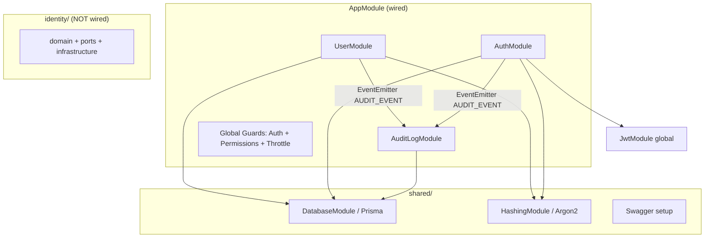

# Architecture

**Pattern:** Modular monolith (NestJS modules por capacidade de negócio)

**Design stance:** [clean-arch-lite](../../.cursor/skills/clean-arch-lite/SKILL.md) — domínio rico **apenas** onde já existe (`src/identity/`); stack ativa permanece pragmática (services + repositories).

## High-Level Structure



## Domains (strategic DDD — resumo)

Fonte detalhada: [docs/domain-analysis-user-auth.md](../../docs/domain-analysis-user-auth.md)

| Domínio | Módulos | Papel |
|---------|---------|-------|
| IAM | `user`, `auth` | User Directory, Authentication, Authorization |
| Audit | `audit-log` | Persistência de trilha via eventos |
| Shared | `shared` | DB, hashing, swagger |

## Identified Patterns

### Application service + repository (stack ativa)

**Location:** `src/user/`, `src/auth/`  
**Purpose:** CRUD, sign-in, emit audit  
**Implementation:** `@Injectable()` services; Prisma em `*Repository` classes (sem port interface)  
**Example:** `UserService` → `UserRepository` + `HashingService` + `EventEmitter2`

### Event-based audit integration

**Location:** `src/audit-log/events/audit.event.ts`, listeners em `AuditLogService`  
**Purpose:** Desacoplar IAM de persistência de audit  
**Implementation:** `eventEmitter.emit(AUDIT_EVENT, new AuditEvent(...))`  
**Example:** `AuthService.signIn` após JWT

### Authorization as subdomain

**Location:** `src/auth/authorization/`  
**Purpose:** RBAC com actions/subjects + `PermissionsGuard`  
**Implementation:** `AbilityFactory`, `policy-map.ts`, `@CheckPermissions()`  
**Example:** `UserController` protegido por permissões

### Rich domain + ports (parallel stack)

**Location:** `src/identity/domain/`, `infrastructure/`, `domain/ports/`  
**Purpose:** Experimento/alvo de migração com entidade, VOs, ports (`USER_REPOSITORY`, etc.)  
**Note:** **Não importado** em `AppModule` — ver CONCERNS.md

## Data Flow

### Sign-in

1. `POST` → `AuthController` → `AuthService.signIn`
2. `AuthRepository.findByEmailWithPassword`
3. `HashingService.verify`
4. `JwtService.signAsync({ sub, email, role })`
5. `EventEmitter` → `AUDIT_EVENT` → `AuditLogService` persiste

### Create user

1. `UserController` (permissions) → `UserService.create`
2. Unicidade email → `HashingService.hash` → `UserRepository.create`
3. Audit `USER_CREATED`

### Authorized request

1. `AuthGuard` valida JWT → `request.user`
2. `PermissionsGuard` + `AbilityFactory` vs policy map

## Code Organization

**Approach:** Feature modules (NestJS) com subpastas por subdomínio onde aplicável (`authorization/`).

**Target layout (pós Phase 1–2):** ver [docs/decomposition-planning-roadmap-user-auth.md](../../docs/decomposition-planning-roadmap-user-auth.md)

```
src/
├── user/              # User Directory (flatten → application/ planned)
├── auth/
│   ├── authentication/   # target: authn leaf (Story 1)
│   └── authorization/
├── audit-log/
│   └── events/        # contract surface for IAM
├── shared/
└── identity/          # parallel — decision pending Story 8
```

**Module boundaries:** Um `*.module.ts` por área; guards globais registrados em `AppModule`.

## Deep-Dive References

- Component sizing: [docs/component-inventory.md](../../docs/component-inventory.md)
- Coupling: [docs/coupling-analysis-user-auth.md](../../docs/coupling-analysis-user-auth.md)
- Domain grouping: [docs/domain-identification-grouping-user-auth.md](../../docs/domain-identification-grouping-user-auth.md)
