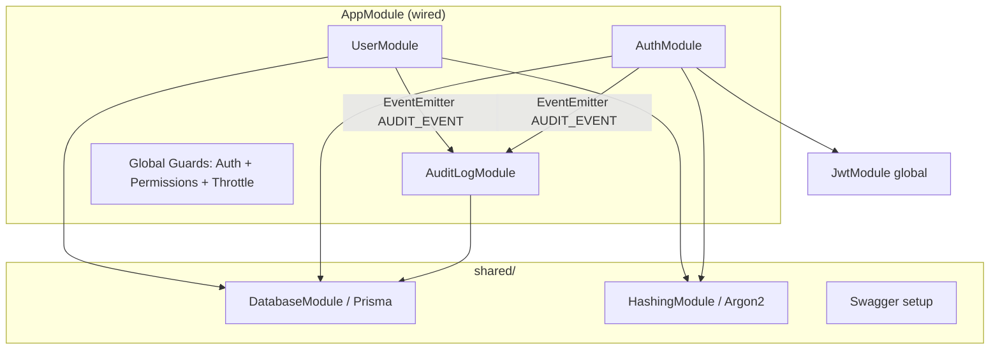

# Architecture

**Pattern:** Modular monolith (NestJS modules por capacidade de negócio)

**Design stance:** [clean-arch-lite](../../.cursor/skills/clean-arch-lite/SKILL.md) — ports em fronteiras de infra (`user/domain/ports/`); stack ativa pragmática (services + repositories). `src/identity/` **deprecada/ausente** — [docs/identity-stack-decision.md](../../docs/identity-stack-decision.md).

## High-Level Structure



## Domains (strategic DDD — resumo)

Fonte detalhada: [docs/domain-analysis-user-auth.md](../../docs/domain-analysis-user-auth.md)

| Domínio | Módulos | Papel |
|---------|---------|-------|
| IAM | `user`, `auth` | User Directory, Authentication, Authorization |
| Audit | `audit-log` | Persistência de trilha via eventos |
| Shared | `shared` | DB, hashing, swagger |

## Identified Patterns

### Application service + repository (stack ativa)

**Location:** `src/user/application/`, `src/auth/authentication/`  
**Purpose:** CRUD, sign-in, emit audit  
**Implementation:** `@Injectable()` services; repos implement ports (`USER_DIRECTORY`, `USER_CREDENTIALS_READER`)  
**Example:** `UserService` → `UserRepository` + `HashingService` + `publishAudit`

### Event-based audit integration

**Location:** `src/audit-log/events/`, `src/audit-log/contracts/`  
**Purpose:** Desacoplar IAM de persistência de audit  
**Implementation:** `publishAudit(emitter, payload)` + `schemaVersion` v1  
**Example:** `AuthService.signIn` após JWT

### Authorization as subdomain

**Location:** `src/auth/authorization/`  
**Purpose:** RBAC com actions/subjects + `PermissionsGuard`  
**Implementation:** `AbilityFactory`, `policy-map.ts`, `@CheckPermissions()`  
**Example:** `UserController` via `@CheckPermissions()` importado de `permissions-api`

### Permissions facade (consumer boundary)

**Location:** `src/permissions-api/`  
**Purpose:** RBAC surface para módulos fora de `auth` sem acoplar path de `authorization/`  
**Implementation:** re-export de `Action`, `Subject`, `CheckPermissions`; `IPermissionChecker` para guards  
**Example:** `user.controller` importa de `permissions-api`

### User ports (extraction prep)

**Location:** `src/user/domain/ports/`  
**Purpose:** `IUserDirectory`, `IUserCredentialsReader` — leitura/escrita separadas do agregado `User`  
**Implementation:** tokens Nest + adapters em `user/application/user.repository.ts`, `auth/authentication/auth.repository.ts`

## Data Flow

### Sign-in

1. `POST` → `AuthController` → `AuthService.signIn`
2. `AuthRepository.findByEmailWithPassword`
3. `HashingService.verify`
4. `JwtService.signAsync({ sub, email, role })`
5. `EventEmitter` → `AUDIT_EVENT` → `AuditLogService` persiste

### Create user

1. `UserController` (permissions) → `UserService.create`
2. Unicidade email → `HashingService.hash` → `UserRepository.create`
3. Audit `USER_CREATED`

### Authorized request

1. `AuthGuard` valida JWT → `request.user`
2. `PermissionsGuard` + `AbilityFactory` vs policy map

## Code Organization

**Approach:** Feature modules (NestJS) com subpastas por subdomínio onde aplicável (`authorization/`).

**Layout atual (Phase 1–3 concluídas):** ver [docs/decomposition-planning-roadmap-user-auth.md](../../docs/decomposition-planning-roadmap-user-auth.md)

```
src/
├── user/
│   ├── application/       # UserModule, controller, service, repository
│   ├── domain/ports/      # IUserDirectory, IUserCredentialsReader
│   └── dto/
├── auth/
│   ├── authentication/
│   └── authorization/
├── audit-log/
│   ├── events/            # publishAudit, AUDIT_EVENT
│   └── contracts/         # v1 schema + AUDIT_CONTRACT_VERSION
├── permissions-api/         # facade RBAC (T12)
└── shared/
    ├── database/
    ├── hashing/
    └── contracts/         # JwtPayload SSOT
```

**Module boundaries:** Um `*.module.ts` por área; guards globais registrados em `AppModule`.

## Phase 3 — Logical service boundaries (complete — readiness only)

Phase 3 entregou **readiness** para extração futura, sem deploy separado (G5 ainda bloqueia). **User Directory** (`src/user/`) com ports; **Access Control** (`src/auth/authentication/` + `src/auth/authorization/` + `permissions-api`); JWT via [`JwtPayload`](../../src/shared/contracts/jwt-payload.ts); **Audit** via `events/` + contrato v1 em `contracts/`. ADRs: [Access Control](../../docs/adr-access-control-service-extraction.md), [Audit](../../docs/adr-audit-service-extraction.md), [coupling addendum](../../docs/coupling-analysis-extraction-readiness.md). Fitness: `npm run check:boundaries`.

## Deep-Dive References

- Component sizing: [docs/component-inventory.md](../../docs/component-inventory.md)
- Coupling: [docs/coupling-analysis-user-auth.md](../../docs/coupling-analysis-user-auth.md)
- Domain grouping: [docs/domain-identification-grouping-user-auth.md](../../docs/domain-identification-grouping-user-auth.md)
