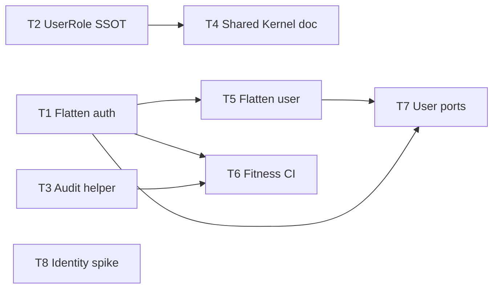

# Modular Monolith IAM — Tasks

**Spec:** `.specs/features/modular-monolith-iam/spec.md`  
**Design:** Inline — `.specs/codebase/ARCHITECTURE.md` + [clean-arch-lite](../../../.cursor/skills/clean-arch-lite/SKILL.md)  
**Status:** Done (T1–T10)

---

## Execution Plan

### Phase 1: Foundation (Sequential)

```
T1 → T2 → T3
```

T1 (flatten auth) before T5 (user flatten) recommended for consistent IAM layout.

### Phase 2: Parallel OK (after T1)

```
T1 ──┬→ T2 [P]
     └→ T3 [P]
```

T2 and T3 independent after T1 optional; can start T2/T3 without T1 if careful with imports.

### Phase 3: Docs & structure

```
T2 ──→ T4
T1 ──→ T5
T3 ──→ T6
```

### Phase 4: Governance & ports

```
T3 + T5 ──→ T6
T1..T3 ──→ T7
T7 ──→ T8
```

### Phase 5: Spike

```
T8 (identity) — no code deps
```

### Phase 6: Extraction readiness (parallel)

```
T9 [P] ──┐
T10 [P] ─┘  (T10 may reference T9 gate doc; no code dep)
```



---

## Pre-Approval Validation

### Check 1: Task Granularity

| Task | Atomic? | Verdict |
|------|---------|---------|
| T1 | One folder move + import fix | ✅ |
| T2 | One enum SSOT change set | ✅ |
| T3 | One helper + contract file | ✅ |
| T4 | Doc-only | ✅ |
| T5 | One folder move (user) | ✅ |
| T6 | One script/eslint rule | ✅ |
| T7 | Port files + adapter wiring | ✅ (may split if >1 day) |
| T8 | Spike doc only | ✅ |

### Check 2: Diagram ↔ Depends on

| Task | Depends on (field) | In diagram? |
|------|-------------------|-------------|
| T1 | None | ✅ root |
| T2 | None | ✅ parallel |
| T3 | None | ✅ parallel |
| T4 | T2 | ✅ T2→T4 |
| T5 | T1 | ✅ T1→T5 |
| T6 | T1, T3 | ✅ |
| T7 | T1, T3, T5 | ✅ via T5,T1 |
| T8 | None | ✅ isolated |

### Check 3: Test Co-location

| Task | Layer touched | Tests field | Matrix match |
|------|---------------|-------------|--------------|
| T1 | services, guards | update/move specs | unit ✅ |
| T2 | DTOs | run existing | unit ✅ |
| T3 | services + events | unit + grep | unit ✅ |
| T4 | docs | none | none ✅ |
| T5 | user module | move/update specs | unit ✅ |
| T6 | CI script | none | none ✅ |
| T7 | repos/services | mock ports in specs | unit ✅ |
| T8 | docs | none | none ✅ |

---

## Task Breakdown

### T1: Flatten Authentication subdomain

**What:** Move authn files into `src/auth/authentication/` and fix all imports  
**Where:** `src/auth/**`, `src/app.module.ts`, `*.spec.ts` under auth  
**Depends on:** None  
**Reuses:** [component-flattening-analysis-user-auth.md](../../../docs/component-flattening-analysis-user-auth.md) checklist  
**Requirement:** IAM-01, IAM-02, IAM-03

**Done when:**

- [x] Files under `authentication/` per spec
- [x] `authorization/` untouched
- [x] Gate: `npm test` passes

**Tests:** unit (update paths in existing specs)  
**Gate:** quick (`npm test`)

**Quick mode eligible:** No (touches >3 files) — use full execute checklist

---

### T2: UserRole SSOT [P]

**What:** Remove duplicate `UserRole` enum; import from `@generated/prisma`  
**Where:** `src/user/dto/*.ts`, any auth DTOs using role  
**Depends on:** None  
**Reuses:** Prisma `UserRole` enum  
**Requirement:** IAM-04, IAM-05

**Done when:**

- [x] No `export enum UserRole` in `src/user/dto`
- [x] Policy map / guards behavior unchanged
- [x] Gate: `npm test` passes

**Tests:** unit  
**Gate:** quick

**Quick mode eligible:** Yes (~2–4 files)

---

### T3: Audit helper + typed contract [P]

**What:** Add `publishAudit` helper + export typed actions; refactor user/auth services  
**Where:** `src/audit-log/events/`, `src/user/user.service.ts`, `src/auth/authentication/auth.service.ts`  
**Depends on:** None  
**Reuses:** `AuditEvent`, `AUDIT_EVENT`  
**Requirement:** IAM-06, IAM-07, IAM-08

**Done when:**

- [x] Helper used by both services
- [x] Grep: no raw `emit(AUDIT_EVENT` outside helper
- [x] `audit-log.service.spec.ts` green
- [x] Gate: `npm test`

**Tests:** unit  
**Gate:** quick

---

### T4: Document Shared Kernel (User table)

**What:** Add section: User Directory owns `User`; Auth uses credentials projection only  
**Where:** `docs/coding-patterns.md` or new `docs/adr-shared-kernel-user.md`  
**Depends on:** T2 (recommended)  
**Requirement:** IAM-09

**Done when:**

- [x] Doc linked from spec or PROJECT
- [x] Cross-links from domain/coupling docs (optional one-liner)

**Tests:** none  
**Gate:** n/a (doc review)

---

### T5: Flatten User Directory application leaf

**What:** Move `user.module`, controller, service, repository to `src/user/application/`  
**Where:** `src/user/**`, `src/app.module.ts`, user specs  
**Depends on:** T1  
**Requirement:** IAM-10, IAM-11

**Done when:**

- [x] `dto/` remains at `src/user/dto/`
- [x] Gate: `npm test` + `npm run build`

**Tests:** unit  
**Gate:** quick

---

### T6: Domain boundary fitness function

**What:** Script or ESLint rule + CI step for cross-domain import rules  
**Where:** `scripts/` or `eslint.config.mjs`, CI workflow if exists  
**Depends on:** T1, T3  
**Requirement:** IAM-12, IAM-13

**Done when:**

- [x] Violation example fails locally
- [x] Allowlist for `audit-log/events`, `shared/*` documented
- [x] Gate: `npm run lint` + script exit 0 on clean tree

**Tests:** none  
**Gate:** build (lint + test)

---

### T7: User persistence ports

**What:** Define `IUserDirectory` + `IUserCredentialsReader` with Symbols; wire repos  
**Where:** `src/user/domain/ports/` or `src/shared/ports/` (prefer user module), adapters in repositories  
**Depends on:** T1, T3, T5  
**Reuses:** clean-arch-lite port pattern  
**Requirement:** IAM-14, IAM-15, IAM-16

**Done when:**

- [x] No repository merge; password projection rules preserved
- [x] Service specs mock ports
- [x] Gate: `npm test`

**Tests:** unit  
**Gate:** quick

**Note:** Introduce `domain/ports/` only here — not full clean arch everywhere.

---

### T8: Identity stack spike [P]

**What:** Written decision: deprecate | migrate | dual-boundary + epic list if migrate  
**Where:** `.specs/project/STATE.md` + short `docs/identity-stack-decision.md`  
**Depends on:** None  
**Requirement:** IAM-17, IAM-18

**Done when:**

- [x] Decision recorded with rationale and next steps

**Tests:** none  
**Gate:** n/a

---

## Story → Task Map

| Roadmap Story | Tasks |
|---------------|-------|
| 1 Flatten auth | T1 |
| 2 UserRole SSOT | T2 |
| 3 Audit contract | T3 |
| 4 Shared Kernel doc | T4 |
| 5 Flatten user | T5 |
| 6 Fitness function | T6 |
| 7 User ports | T7 |
| 8 Identity spike | T8 |
| 9 Audit extraction readiness | T9 |
| 10 Access Control extraction readiness | T10 |

---

### T9: Audit extraction readiness (Story 9) [P]

**What:** Feasibility gate doc + audit event JSON Schema v1 + `schemaVersion` on publish + ADR blueprint  
**Where:** `docs/extraction-feasibility-gate.md`, `docs/adr-audit-service-extraction.md`, `src/audit-log/contracts/`, `src/audit-log/events/`  
**Depends on:** T1–T7 (Phase 2 complete)  
**Reuses:** `AuditEvent`, `publishAudit`, `AuditAction`  
**Requirement:** IAM-19, IAM-20, IAM-21

**Done when:**

- [x] G1–G6 table with post–Phase 2 status; G5 marked blocking deploy
- [x] `audit-event.v1.schema.json` + `AUDIT_CONTRACT_VERSION` exported
- [x] `AuditEvent` / `publishAudit` set `schemaVersion`
- [x] ADR: consumer boundary, no IAM→`audit-log.service`, rollback plan
- [x] Unit test asserts serialized event shape matches v1 contract
- [x] Gate: `npm test`

**Tests:** unit (contract shape)  
**Gate:** quick

---

### T10: Access Control extraction readiness (Story 10) [P]

**What:** `JwtPayload` SSOT + guards refactor + Access Control ADR + coupling addendum  
**Where:** `src/shared/contracts/`, `src/auth/authentication/auth.guard.ts`, `src/auth/authorization/permissions.guard.ts`, `docs/adr-access-control-service-extraction.md`, `docs/coupling-analysis-extraction-readiness.md`  
**Depends on:** T7 (ports); T9 recommended (shared gate doc)  
**Reuses:** ports ADR, feasibility gate from T9  
**Requirement:** IAM-22, IAM-23, IAM-24

**Done when:**

- [x] `JwtPayload` in `shared/contracts`; guards use it (no local duplicate interface)
- [x] ADR: JWT outside User Directory deployable; claims API vs Shared Kernel
- [x] Coupling addendum: no CRITICAL edges for authn+authz split; references T7 ports
- [x] Gate: `npm test` + `npm run check:boundaries`

**Tests:** unit (existing guard specs green)  
**Gate:** quick

---

## Execute Next

**Phase 3 complete (T9–T10).** Deploy extraction blocked until **G5** (product trigger). Optional: docs hygiene, E2E auth/user, `IPermissionChecker` facade.

For **individual story execution**, use Quick Mode pre-check per task when ≤3 files (T2, T3, T4, T8).
