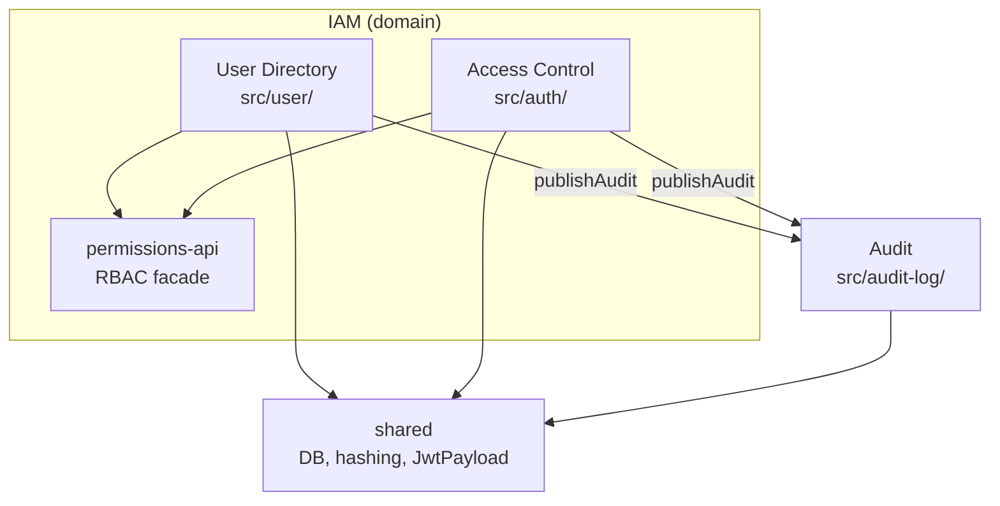

# Architecture Guidelines (for agents & contributors)

Entry guide for LLMs and maintainers: **what exists**, **how modules relate**, and **where to go deeper**. Does not replace code examples — use [coding-patterns.md](./coding-patterns.md) when implementing.

**Domain glossary (no implementation):** [CONTEXT.md](./CONTEXT.md)

---

## 1. How to read this repo (progressive loading)

| Order | Document | When to load |
|-------|----------|--------------|
| 1 | [coding-patterns.md](./coding-patterns.md) | Before any change under `src/` |
| 2 | This file | Architectural view and module boundaries |
| 3 | [CONTEXT.md](./CONTEXT.md) | Terminology (User vs principal, audit actor, etc.) |
| 4 | Topic-specific | JWT → [jwt-authentication.md](./jwt-authentication.md); RBAC → [authorization.md](./authorization.md); audit → [audit-log.md](./audit-log.md); security → [security.md](./security.md) |
| 5 | Brownfield / spec | [.specs/codebase/ARCHITECTURE.md](../.specs/codebase/ARCHITECTURE.md), [modular-monolith-iam spec](../.specs/features/modular-monolith-iam/spec.md) |
| 6 | DDD / extraction | [domain-analysis-user-auth.md](./domain-analysis-user-auth.md), ADRs under `docs/adr-*.md` |

**Do not load everything at once.** Skills: `clean-arch-lite` (structure), `tactical-ddd` (only when adding rich domain entities).

---

## 2. System shape

| Attribute | Value |
|-----------|--------|
| Style | Modular monolith (NestJS) |
| Active stack | `user`, `auth`, `audit-log`, `permissions-api`, `shared` — wired in `AppModule` |
| Dead stack | `src/identity/` — **absent and deprecated** ([identity-stack-decision.md](./identity-stack-decision.md)) |
| Repo goal | IAM patterns reference, not a product with a commercial core domain |
| Stance | [clean-arch-lite](../.cursor/skills/clean-arch-lite/SKILL.md): ports at boundaries only; services + repositories in current IAM |



---

## 3. Module responsibilities

| Module | Subdomain | Responsibility | Does not |
|--------|-----------|----------------|----------|
| `src/user/` | User Directory | User CRUD, hash on create, USER_* audit | Sign-in, issue JWT, define policy |
| `src/auth/authentication/` | Authentication | Sign-in, JWT, `AuthGuard`, `@Public()` routes | User CRUD, RBAC policy |
| `src/auth/authorization/` | Authorization | Policy map, `AbilityFactory`, permission guards | Persist User |
| `src/permissions-api/` | Facade | Re-export Action/Subject/`@CheckPermissions`; `IPermissionChecker` | Ability implementation (stays in auth) |
| `src/audit-log/` | Audit | v1 contract, listener, persistence | Be imported by IAM except `events/` |
| `src/shared/` | Shared infra | Prisma, Argon2, `JwtPayload` SSOT, Swagger | IAM business rules |

**Ownership (Shared Kernel):** User Directory **owns** the `User` model (migrations, create/update/delete). Authentication uses **credentials projection** via port — see [adr-shared-kernel-user.md](./adr-shared-kernel-user.md).

---

## 4. Physical layout (active stack)

```
src/
├── user/
│   ├── application/     # module, controller, service, repository adapter
│   ├── domain/ports/    # IUserDirectory, IUserCredentialsReader (symbols)
│   └── dto/
├── auth/
│   ├── authentication/  # sign-in, guard, auth repository
│   ├── authorization/   # policy, ability, permissions guard
│   └── auth.module.ts
├── audit-log/
│   ├── events/          # publishAudit, AUDIT_EVENT — only IAM→audit surface
│   └── contracts/       # schema v1
├── permissions-api/     # non-auth consumers import from here
└── shared/
    ├── database/
    ├── hashing/
    └── contracts/       # JwtPayload
```

Pattern details (ports, DI, tests): [coding-patterns.md](./coding-patterns.md).

---

## 5. Cross-module rules (fitness function)

Enforced by `yarn run check:boundaries` ([scripts/check-domain-boundaries.mjs](../scripts/check-domain-boundaries.mjs)).

| From | To | Allowed |
|------|-----|---------|
| `user`, `auth` | `audit-log` | Only `src/audit-log/events/*` (`publishAudit`) |
| `user`, `auth` | `shared` | `database`, `hashing`, `swagger`, `contracts` |
| `user` | `auth` | Only `src/permissions-api` (not `auth/authorization/*`) |
| `auth` | `user` | Only `src/user/domain/ports` |
| Any IAM | `audit-log` service/repo/module | **Forbidden** |

**Implications for agents:**

- Never inject `AuditLogService` into `UserService` / `AuthService`.
- Controllers in `user` import `Action`, `Subject`, `CheckPermissions` from `permissions-api`.
- `passwordHash` only in the credentials adapter (`AuthRepository`), never in `IUserDirectory` returns.

---

## 6. Request & write flows

### Sign-in

1. `POST` → `AuthController` → `AuthService.signIn`
2. `USER_CREDENTIALS_READER` → Argon2 verification
3. JWT (`sub`, `email`, `role`) via `JwtPayload` SSOT
4. `publishAudit` → `AUTH_LOGIN`

### Create user

1. `UserController` + `@CheckPermissions`
2. `UserService.create` → email uniqueness → hash → `USER_DIRECTORY`
3. `publishAudit` → `USER_CREATED`

### Protected request

1. Global `AuthGuard` → `request.user` (JWT)
2. Global `PermissionsGuard` → `@CheckPermissions` → `AbilityFactory` + policy map

Diagrams and permission matrix: [authorization.md](./authorization.md), [jwt-authentication.md](./jwt-authentication.md).

---

## 7. Design decisions (stable)

| Decision | Rationale | Doc |
|----------|-----------|-----|
| Deprecate `src/identity/` | Single stack; no dual boundary | [identity-stack-decision.md](./identity-stack-decision.md) |
| Event-based audit | IAM not coupled to audit persistence | [audit-log.md](./audit-log.md), [adr-audit-service-extraction.md](./adr-audit-service-extraction.md) |
| `permissions-api` | RBAC consumable without importing `auth/authorization/` | [authorization.md](./authorization.md) |
| Ports in `user/domain/ports` | Prepare User Directory vs Access Control extraction | [adr-access-control-service-extraction.md](./adr-access-control-service-extraction.md) |
| `UserRole` / `AuditAction` SSOT | `@generated/prisma` — no duplicate enums in DTOs | [coding-patterns.md](./coding-patterns.md) |
| Phase 3 = readiness only | No microservices until product gate (G5) | [extraction-feasibility-gate.md](./extraction-feasibility-gate.md) |

---

## 8. Anti-patterns (do not introduce)

- Recreate `src/identity/` or an `application/` folder per operation without need.
- Use-case class per method; mapper per field; interface per internal class.
- Import `audit-log.service` / `audit-log.module` from IAM.
- Import `auth/authorization/*` from `user` (use `permissions-api`).
- Return `passwordHash` on directory reads.
- Duplicate `UserRole` or `JwtPayload` outside documented SSOTs.
- Generic `try/catch`; obvious comments; `any` type.

Explicit anti-bloat: [coding-patterns.md](./coding-patterns.md#anti-bloat-rules).

---

## 9. New module checklist (summary)

Copy the full list from [coding-patterns.md](./coding-patterns.md#new-module-checklist). Minimum:

- [ ] `yarn run check:boundaries`
- [ ] Audit via `publishAudit` only
- [ ] RBAC via `permissions-api` when outside `auth`
- [ ] `yarn test` + `yarn test:e2e` green

---

## 10. Deep-dive index (existing docs)

| Topic | File |
|-------|------|
| Code patterns | [coding-patterns.md](./coding-patterns.md) |
| IAM domain (DDD) | [domain-analysis-user-auth.md](./domain-analysis-user-auth.md) |
| Component grouping | [domain-identification-grouping-user-auth.md](./domain-identification-grouping-user-auth.md) |
| Inventory / sizing | [component-inventory.md](./component-inventory.md) |
| Coupling | [coupling-analysis-user-auth.md](./coupling-analysis-user-auth.md) |
| Decomposition roadmap | [decomposition-planning-roadmap-user-auth.md](./decomposition-planning-roadmap-user-auth.md) |
| Shared Kernel User | [adr-shared-kernel-user.md](./adr-shared-kernel-user.md) |
| Access Control extraction | [adr-access-control-service-extraction.md](./adr-access-control-service-extraction.md) |
| Audit extraction | [adr-audit-service-extraction.md](./adr-audit-service-extraction.md) |
| Prisma | [prisma-migrations.md](./prisma-migrations.md) |
| Code conventions | [.specs/codebase/CONVENTIONS.md](../.specs/codebase/CONVENTIONS.md) |
| Testing | [.specs/codebase/TESTING.md](../.specs/codebase/TESTING.md) |

---

## 11. Commands (quick reference)

| Command | Use |
|---------|-----|
| `yarn build` | Compile |
| `yarn test` | Unit/integration |
| `yarn test:e2e` | E2E (`test/auth-user.e2e-spec.ts`) |
| `yarn lint` | ESLint |
| `yarn run check:boundaries` | Cross-domain import limits |
| `yarn prisma migrate dev --name <n>` | Migration (never hand-written SQL) |

See also [AGENTS.md](../AGENTS.md).
