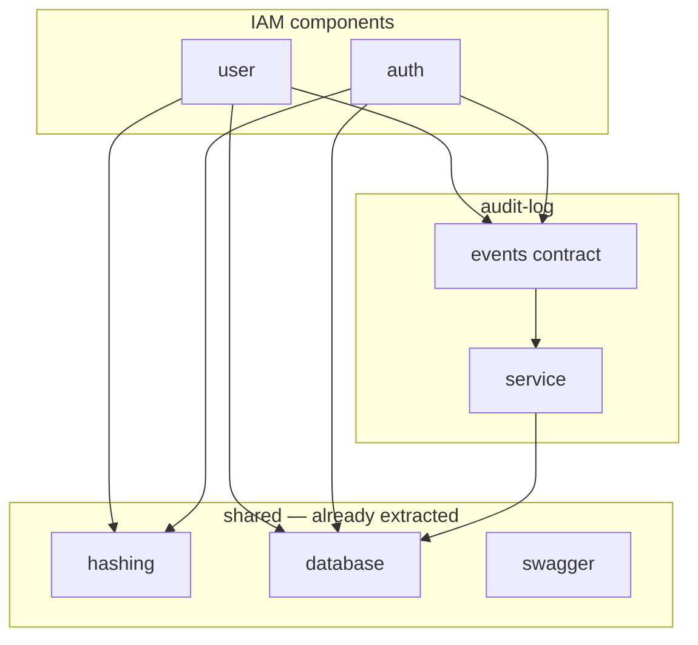

# Common Domain Detection: IAM (`user`, `auth`, `audit-log`)

Detection of duplicate or spread **domain** functionality across components, with consolidation recommendations. Uses the **component-common-domain-detection** skill.

**Inputs:** [Domain Analysis](./domain-analysis-user-auth.md), [Component Inventory](./component-inventory.md), [Coupling Analysis](./coupling-analysis-user-auth.md)  
**Scope:** Logical components from inventory — `src/user/`, `src/auth/` (Authentication + Authorization), `src/audit-log/`, `src/shared/` (as shared infrastructure baseline)  
**Date:** 2026-05-20

---

## Executive Summary

```
COMPONENTS SCANNED:     10 logical (inventory) + 3 shared infra leaf folders
COMMON PATTERNS FOUND:  4 domain-relevant groups
ALREADY CONSOLIDATED:   3 (hashing, database, swagger tags)
CONSOLIDATION CANDIDATES: 3 (audit publish, UserRole type, user persistence ports)
NOT RECOMMENDED:        4 (merge repos, merge modules, direct audit service, auth+authz merge)
```

| Verdict | Count | Meaning |
|---------|-------|---------|
| ✅ Already shared | 3 | Infrastructure correctly extracted |
| ✅ Consolidate (high) | 1 | `UserRole` / identity types — low coupling risk |
| ⚠️ Consolidate (medium) | 2 | Audit publisher helper; persistence ports (not repo merge) |
| ❌ Do not consolidate | 4 | Would increase coupling or blur boundaries |

This reference monolith is **~350 statements** in scope. Recommendations favor **small shared libraries and facades**, not new deployable services.

---

## Component Baseline (from prior analyses)

| Component | Path | Statements | Role |
|-----------|------|------------|------|
| User Directory (core) | `src/user/` (excl. `dto/`) | 136 | CRUD + audit emit + hash on create |
| Authentication | `src/auth/` (excl. `authorization/`, `dto/`) | 75 | Sign-in, JWT, guard |
| Authorization | `src/auth/authorization/` | 62 | RBAC policy, guards, decorators |
| Audit Log (core) | `src/audit-log/` (excl. `events/`) | 21 | Persist audit rows |
| Audit Events (contract) | `src/audit-log/events/` | 6 | `AUDIT_EVENT` + `AuditEvent` |
| Shared: Hashing | `src/shared/hashing/` | 15 | Argon2 hash/verify |
| Shared: Database | `src/shared/database/` | 11 | Prisma client |
| Shared: Swagger | `src/shared/swagger/` | 10 | OpenAPI tags/setup |
| User DTOs | `src/user/dto/` | 12 | HTTP validation |
| Auth DTOs | `src/auth/dto/` | 2 | Sign-in DTO |

---

## Phase 1: Common Namespace Patterns

Leaf-node scan over scoped paths (excluding `*.spec.ts`):

| Leaf node | Occurrences | Domain or infrastructure? | Consolidate? |
|-----------|-------------|---------------------------|--------------|
| `repository` | `user`, `auth`, `audit-log` | Domain persistence (3 different aggregates) | ❌ No — different models and projections |
| `service` | `user`, `auth`, `audit-log` | Application services | ❌ No — different subdomains |
| `dto` | `user`, `auth` | HTTP contracts | ❌ No — different commands/queries |
| `authorization` | `auth` only (active app) | RBAC | N/A — single component |
| `events` | `audit-log` only | Integration contract | ✅ Keep separate (correct boundary) |
| `hashing` | `shared` | Infrastructure | ✅ Already consolidated |
| `database` | `shared` | Infrastructure | ✅ Already consolidated |

**No duplicate “notification-style” siblings** (e.g. multiple `*.audit` packages). Audit is **one consumer module** with **multiple publishers** — pattern is spread **logic**, not spread **components**.

---

## Phase 2: Shared Classes & Cross-Component Usage

### Domain-relevant (used by 2+ components)

| Symbol / module | Used by | Classification | Status |
|-----------------|---------|----------------|--------|
| `HashingService` | `user.service`, `auth.service` | Domain-adjacent crypto | ✅ **Shared library** (`shared/hashing`) |
| `AUDIT_EVENT`, `AuditEvent` | `user.service`, `auth.service`, `audit-log.service` | Domain audit contract | ⚠️ Contract exists; **emit boilerplate duplicated** |
| `PrismaService` / `User` model | `user.repository`, `auth.repository`, `audit-log.repository` | Persistence | ✅ DB shared; ⚠️ **two User accessors** |
| `UserRole` | `create-user.dto` (local enum), `policy-map`, `permissions.guard`, JWT payload | Identity vocabulary | ❌ **Symmetric duplication** (not shared file) |
| `Action`, `Subject`, `CheckPermissions` | `user.controller` ← `auth/authorization` | Published permission API | ✅ Single provider; not duplicated |

### Infrastructure (excluded from domain consolidation)

| Symbol | Used by | Note |
|--------|---------|------|
| `DatabaseModule` | `user`, `auth`, `audit-log` modules | Correct |
| `SwaggerApiTags` | `user.controller`, `auth.controller` | Correct |
| `EventEmitterModule` | `app.module` (global) | Infrastructure bus |
| `AuthGuard`, `PermissionsGuard` | `app.module` (global) | Composition root — not duplicated per feature |

---

## Phase 3: Functionality Similarity Analysis

### Group A — Audit event publishing (spread domain logic)

**Locations:**

| Publisher | Emits | Statements (emit blocks) |
|-----------|-------|---------------------------|
| `user.service.ts` | `USER_CREATED`, `USER_UPDATED`, `USER_DELETED` | 3 × `eventEmitter.emit(AUDIT_EVENT, new AuditEvent(...))` |
| `auth.service.ts` | `AUTH_LOGIN` | 1 × same pattern |

**Similarities:**

- Same transport: `EventEmitter2` + `AUDIT_EVENT` + `AuditEvent`
- Same shape: `(action, entityId, userId, metadata)`
- Same coupling analysis verdict: contract coupling, do not call `AuditLogService` directly

**Differences:**

- Action codes and metadata payloads per use case (expected)

**Consolidation feasibility:** ✅ **High** for **mechanism**, not for **business payloads**

- Differences are contextual (action + metadata), not alternate stacks
- Can abstract with `publishAudit(event: AuditEvent)` or `IamAuditPublisher.publish(action, ...)`

**Do not:** Move persistence into publishers or merge `audit-log` into `user`/`auth` (coupling analysis **not recommended**).

---

### Group B — User aggregate persistence (parallel adapters)

**Locations:**

| Adapter | Access pattern |
|---------|----------------|
| `user.repository.ts` | CRUD; always `omit: { passwordHash: true }` |
| `auth.repository.ts` | `findByEmailWithPassword` — full row including hash |

**Similarities:**

- Same Prisma `User` table
- Same `email` lookup key for auth path

**Differences:**

- **Intentional projection boundary** (directory vs credentials)
- Different methods and security rules

**Consolidation feasibility:** ❌ **Low** for **single repository class** | ⚠️ **Medium** for **shared ports module**

- Merging repos would mix concerns and weaken omit rules (domain + coupling analyses)
- **Ports** (`IUserDirectory`, `IUserCredentialsReader`) share **interface**, not **implementation**

---

### Group C — Password cryptography (related, not duplicate)

| Operation | Component | Uses |
|-----------|-----------|------|
| Hash on create | `user.service` | `hashingService.hash()` |
| Verify on sign-in | `auth.service` | `hashingService.verify()` |

**Verdict:** ✅ **Already consolidated** in `HashingService`. No second hashing implementation to merge.

---

### Group D — `UserRole` vocabulary (symmetric functional duplication)

**Definitions today:**

| Location | Source |
|----------|--------|
| `prisma/schema.prisma` | `enum UserRole` (canonical persistence) |
| `src/user/dto/create-user.dto.ts` | Duplicate `enum UserRole` |
| `src/auth/authorization/policy-map.ts` | `UserRole` from `@generated/prisma` |
| `src/auth/authorization/permissions.guard.ts` | `JwtPayload.role: UserRole` |
| `src/auth/auth.guard.ts` | JWT verify types `role: string` |

**Similarities:** Same three values: `ADMIN`, `MANAGER`, `USER`

**Differences:** DTO enum is redundant; JWT guard uses weaker typing

**Consolidation feasibility:** ✅ **High** — single type export, no new service

---

### Group E — Authorization vs Authentication (same package, not duplicate logic)

**Domain analysis:** Two subdomains in one Nest module (`auth/`).

| Aspect | Authentication | Authorization |
|--------|----------------|---------------|
| Vocabulary | Sign-in, JWT, Bearer | Action, Subject, Ability |
| Artifacts | `auth.service`, `auth.guard` | `policy-map`, `permissions.guard` |

**Consolidation feasibility:** ❌ **Low** for **merging into one component**

- Coupling analysis: runtime cohesion is **good** at low distance
- Recommendation: **folder/module split** when growing, not merge into `user`

---

## Phase 4: Coupling Impact (Afferent Coupling — CA)

**CA** = number of scoped components/modules that depend on the consolidated artifact.

### Current state (publishers / shared usage)

| Artifact | Dependents (CA) | Notes |
|----------|-----------------|-------|
| `HashingService` | 2 (`user`, `auth`) | Via shared module |
| `AuditEvent` contract | 2 publishers + 1 consumer | Event bus decouples consumer |
| `User` Prisma access | 2 repos | Implicit shared kernel |
| `authorization` barrel | 1 (`user.controller`) | Room to grow |

### If consolidated (estimates)

| Proposal | Before (effective CA) | After CA | Δ | Verdict |
|----------|----------------------|----------|---|---------|
| `IamAuditPublisher` in `audit-log/events` or `shared/audit` | 2 publishers duplicate code | 2 modules inject publisher | 0 | ✅ Safe |
| Typed `AuditAction` in events module | 2 + consumer (meaning) | 3 import contract | 0 | ✅ Safe |
| Single `UserRepository` | 2 adapters | 2 concerns in 1 class | N/A | ❌ Blurs boundary |
| Ports module for User | 2 repos | 2 implement ports + 2 consumers | 0–1 | ✅ Safe |
| `UserRole` from `@generated/prisma` in DTOs | 3+ type sites | 1 canonical + imports | 0 | ✅ Safe |
| Merge `user` + `auth` Nest modules | 2 modules | 1 mega-module | −1 modules, **+** internal coupling | ❌ Too risky |
| Merge `authentication` + `authorization` | 2 folders | 1 | −1 | ❌ Worse linguistic boundary |

**Rule applied:** Consolidation is attractive when **total CA stays flat** and **duplication of business rules** drops. Merging repositories or IAM modules fails the boundary test even if CA unchanged.

---

## Common Domain Components Found (detail)

### 1. Audit publishing mechanism

**Components involved:**

- User Directory (core) — 3 emit sites in `user.service.ts`
- Authentication — 1 emit site in `auth.service.ts`
- Audit Events (contract) — `audit-log/events/audit.event.ts` (6 stmts)

**Shared classes:** `AUDIT_EVENT`, `AuditEvent` (all publishers + consumer)

**Functionality analysis:**

- **Similarities:** Identical emit idiom
- **Differences:** Action/metadata only
- **Feasibility:** ✅ High (helper/facade)

**Coupling analysis:**

- Before: 2 modules × direct `EventEmitter2` + string actions
- After: 2 modules × thin publisher; contract coupling unchanged
- **Verdict:** ✅ Safe (aligns with [coupling analysis](./coupling-analysis-user-auth.md) typed contract recommendation)

**Recommendation:** **Shared library** — extend `audit-log/events/`:

```typescript
// Example shape (not implemented in repo yet)
export function publishAudit(emitter: EventEmitter2, event: AuditEvent): void {
  emitter.emit(AUDIT_EVENT, event);
}
// Plus: export type AuditAction from Prisma or const map
```

**Approach:** Shared library (compile-time), not new deployable service.

---

### 2. User aggregate access (duplicate adapters, not duplicate services)

**Components:**

- `user.repository.ts` (43 stmts — inventory)
- `auth.repository.ts` (4 stmts)

**Functionality analysis:**

- **Feasibility:** ❌ Merge | ⚠️ Ports

**Coupling analysis:**

- Shared kernel on `User` table — [domain analysis](./domain-analysis-user-auth.md) cohesion 7/10
- [Coupling analysis](./coupling-analysis-user-auth.md): **do not merge** repositories

**Recommendation:**

- **Do not** consolidate into one repository class
- **Do** introduce `IUserDirectory` + `IUserCredentialsReader` when splitting contexts (Option B)
- Document owner: User Directory owns schema lifecycle; Authentication read-only credentials

---

### 3. `UserRole` definitions (symmetric duplication)

**Components / sites:** User DTOs, Authorization policy, JWT guards

**Functionality analysis:**

- Same enum values, different type definitions
- **Feasibility:** ✅ High

**Coupling analysis:**

- CA unchanged if DTOs import `@generated/prisma` `UserRole`
- Reduces functional (symmetric) coupling flagged in domain analysis

**Recommendation:** **Shared library** — re-export `UserRole` from Prisma in DTOs; add `JwtPayload` in `src/auth/types/` (or `authorization/`).

---

### 4. Password hashing (already resolved)

**Recommendation:** None — keep `shared/hashing`; do not duplicate verify logic in `user` module ([domain analysis](./domain-analysis-user-auth.md) low-priority issue).

---

## Consolidation Opportunities Table

| Common functionality | Spread across | Current CA | After CA | Feasibility | Recommendation |
|----------------------|---------------|------------|----------|-------------|----------------|
| Audit emit boilerplate | `user.service`, `auth.service` | 2 publishers | 2 (inject helper) | ✅ High | Shared helper in `audit-log/events` |
| `AuditAction` typing | Publishers + consumer cast | 3 (implicit) | 3 (explicit import) | ✅ High | Export typed actions from events module |
| `UserRole` enum | DTO + Prisma + JWT/policy | 3+ sites | 1 canonical | ✅ High | DTOs use `@generated/prisma` |
| `User` persistence | 2 repositories | 2 | 2 ports + 2 impl | ⚠️ Medium | Ports module; **no** repo merge |
| Authorization API | 1 consumer (`user`) | 1 | 1 | ✅ Done | `src/permissions-api/` facade (T12); `user.controller` importa facade |
| Authentication + Authorization | Same `auth/` package | — | — | ❌ Low | Folder split, not merge |
| Hashing / Database / Swagger | `shared/*` | 2–3 | — | ✅ Done | Maintain as infrastructure |

---

## Consolidation Plan

### Priority: High

#### A. Typed audit contract + publish helper

**Target:** `src/audit-log/events/` (grow contract component from 6 → ~15–25 stmts)

**Steps:**

1. Export `AuditAction` type (from `@generated/prisma` or `as const` map aligned with schema).
2. Add `publishAudit(emitter, event)` (or `IamAuditPublisher` injectable).
3. Replace 4 emit blocks in `user.service` / `auth.service` with helper + typed actions.
4. Update tests in `user.service.spec`, `auth.service.spec` (assertions unchanged semantically).

**Expected impact:**

- **Duplication:** ~12–16 repeated lines → 1 helper
- **Coupling:** Unchanged (still event-based; [coupling analysis](./coupling-analysis-user-auth.md) ✅)
- **Risk:** Low — behavior preserved

---

#### B. Single source for `UserRole`

**Target:** `src/user/dto/create-user.dto.ts`, `update-user.dto.ts`, `auth.guard.ts`

**Steps:**

1. Remove local `enum UserRole` from `create-user.dto.ts`.
2. `import type { UserRole } from '@generated/prisma'` in DTOs.
3. Introduce shared `JwtPayload` used by `auth.guard` and `permissions.guard`.

**Expected impact:**

- Eliminates symmetric duplication ([domain analysis](./domain-analysis-user-auth.md) low-priority issue)
- **CA:** unchanged

---

### Priority: Medium

#### C. User persistence ports (before service split)

**Target:** new `src/user/ports/` or `src/identity-access/ports/` (name when introduced)

**Steps:**

1. Define `IUserDirectory` (CRUD, omit hash) and `IUserCredentialsReader` (email + hash).
2. Implement with existing repositories (no behavior change).
3. Inject ports in services instead of concrete repos when touching those files.

**Expected impact:**

- Prepares Option B contexts without merging repos
- Supports [component inventory](./component-inventory.md) “duplicate persistence” note

---

#### D. Permissions facade — **implemented (T12)**

**Location:** `src/permissions-api/` — re-export `CheckPermissions`, `Action`, `Subject`; `IPermissionChecker` para guards.

**Consumer:** `user.controller` importa de `permissions-api` (não de `auth/authorization/` diretamente).

---

### Priority: Low / defer

| Item | Action |
|------|--------|
| Split `auth/` into `authentication/` + `authorization/` folders | Structural clarity only |
| Merge Auth DTOs into controller file | Cosmetic (inventory: Auth DTOs undersized) |
| Extract `audit-log` microservice | Only with versioned contract + independent scaling need |

---

## Do Not Consolidate (explicit)

| Proposal | Why not |
|----------|---------|
| Single `UserRepository` for user + auth | Breaks password omission boundary; increases model coupling |
| Inject `AuditLogService` into IAM services | Intrusive coupling ([coupling analysis](./coupling-analysis-user-auth.md)) |
| Merge `UserModule` + `AuthModule` | Blurs User Directory vs Authentication subdomains |
| Merge Authorization into User Controller | Duplicates guard/policy pipeline globally wired in `app.module` |
| Consolidate `*.repository` leaf pattern across audit/user/auth | Different aggregates (`User` vs `AuditLog`) |

---

## Already Consolidated (positive patterns)



| Extracted capability | Location | Consumers (CA) |
|---------------------|----------|----------------|
| Password hash/verify | `shared/hashing` | 2 |
| Prisma client | `shared/database` | 3 |
| Swagger tags | `shared/swagger` | 2 |
| Audit persistence | `audit-log` only | 0 inbound from IAM (events only) |

These match the skill’s rule: **infrastructure common to all or most processes** stays in shared modules; **domain logic common to some processes** is what we target above.

---

## Cross-Reference: Prior analyses

| Finding | Common-domain interpretation |
|---------|------------------------------|
| Domain: IAM cohesion 4/10 with Audit | Correct **event** integration; consolidate **emit helper**, not modules |
| Domain: duplicate User repos | **Ports**, not merge — duplicate adapters |
| Domain: `UserRole` spread | **Consolidate types** — clearest win |
| Coupling: do not call `AuditLogService` | Confirms **publisher helper** only |
| Coupling: Customer/Supplier user→authz | No consolidation — optional facade only |
| Inventory: User Directory 39% | Watch `user.service` growth; audit helper reduces noise |
| Inventory: `audit-log/events` separate | **Keep** as contract component; extend in place |

---

## Repository note: `src/identity/`

**Status (2026-05-20):** **Deprecado** — `Test-Path src/identity` = False; pasta ausente. Decisão: [identity-stack-decision.md](./identity-stack-decision.md). Stack única = `user` + `auth` + `audit-log` + `permissions-api`.

Análises antigas que citam ~78 arquivos em `identity/` descrevem layout **historico**. Não reabrir dual stack sem decisão de produto explícita.

---

## Fitness Functions (suggested)

```javascript
// Alert: duplicate UserRole enum outside generated client
// Scan src/user/dto for /^export enum UserRole/

// Alert: direct EventEmitter emit of AUDIT_EVENT outside audit helper
// Grep: eventEmitter.emit(\s*AUDIT_EVENT in src/user, src/auth — allowlist audit helper file

// Alert: new *.repository sibling without domain review
// Leaf 'repository' under src/ with >1 Prisma model accessor
```

---

## Analysis Checklist

**Common pattern detection**

- [x] Scanned leaf namespaces (`repository`, `service`, `dto`, `events`, `authorization`)
- [x] Filtered infrastructure leaves (`hashing`, `database`, `swagger`)
- [x] Grouped audit publishers vs single audit consumer

**Shared class detection**

- [x] Mapped imports across user, auth, audit-log, shared
- [x] Classified domain vs infrastructure
- [x] Documented `UserRole` symmetric duplication

**Functionality analysis**

- [x] Compared audit emit blocks, repo adapters, hashing usage
- [x] Assessed abstractability of differences
- [x] Marked auth+authz as structural split, not merge candidate

**Coupling assessment**

- [x] Estimated CA before/after per proposal
- [x] Cross-checked with coupling analysis “not recommended” list

**Recommendations**

- [x] Prioritized high/medium/low consolidation plan
- [x] Documented do-not-consolidate list
- [x] Linked to domain, inventory, coupling docs

---

## Related Documentation

- [Domain Analysis: User & Auth](./domain-analysis-user-auth.md)
- [Component Inventory](./component-inventory.md)
- [Coupling Analysis: User & Auth](./coupling-analysis-user-auth.md)
- [Audit Log](./audit-log.md)
- [Authorization](./authorization.md)
