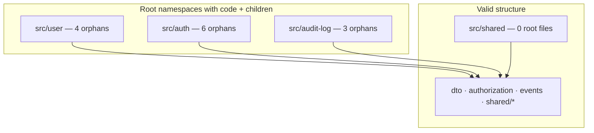

# Component Flattening Analysis: IAM (`user`, `auth`, `audit-log`, `shared`)

Hierarchy and orphaned-class analysis per the **component-flattening-analysis** skill. Identifies root namespaces that contain source files while also being extended by child directories, and recommends flattening strategies.

**Inputs:** [Domain Analysis](./domain-analysis-user-auth.md), [Component Inventory](./component-inventory.md), [Coupling Analysis](./coupling-analysis-user-auth.md), [Common Domain Detection](./common-domain-detection-user-auth.md)  
**Scope:** `src/user/`, `src/auth/`, `src/audit-log/`, `src/shared/` (production `.ts`; tests noted where paths change)  
**Date:** 2026-05-20

---

## Executive Summary

```
ROOT NAMESPACES WITH ORPHANED CODE:  3  (user, auth, audit-log)
VALID SUBDOMAIN (no root code):      1  (shared)
STRICT LEAF-ONLY VIOLATIONS:        13 orphaned production files
RECOMMENDED FLATTENS:                1 high, 2 medium, 1 defer
NO ACTION (by design):               2  (audit-log/events, shared/*)
```

| Path | Root files | Child leaves | Issue | Strategy |
|------|------------|--------------|-------|----------|
| `src/user/` | 4 | `dto/` | Orphaned core Nest files | ⚠️ Split up (optional) |
| `src/auth/` | 6 | `authorization/`, `dto/` | Orphaned authn + nested authz | ✅ **Split up** (high) |
| `src/audit-log/` | 3 | `events/` | Orphaned persistence wiring | ⚠️ Split up or accept |
| `src/shared/` | 0 | `database/`, `hashing/`, `swagger/` | None | ✅ OK |

**Overall:** Structure matches common **NestJS module-at-root** layout. Strict “components = leaf nodes only” is **violated** in three IAM folders; the highest-value fix aligns with [domain analysis](./domain-analysis-user-auth.md): **split Authentication out of `src/auth/` root** into a leaf folder, without merging Authorization into User or collapsing `audit-log/events`.

---

## Phase 1: Component Structure Map

### Namespace tree (production sources)

```
src/
├── user/                          ← ROOT NAMESPACE (extended by dto/)
│   ├── user.module.ts             ← ORPHAN
│   ├── user.controller.ts         ← ORPHAN
│   ├── user.service.ts            ← ORPHAN
│   ├── user.repository.ts         ← ORPHAN
│   └── dto/                       ← LEAF COMPONENT (3 files)
│       ├── create-user.dto.ts
│       ├── update-user.dto.ts
│       └── find-all-users-query.dto.ts
│
├── auth/                          ← ROOT NAMESPACE (extended by authorization/, dto/)
│   ├── auth.module.ts             ← ORPHAN
│   ├── auth.controller.ts         ← ORPHAN
│   ├── auth.service.ts            ← ORPHAN
│   ├── auth.repository.ts         ← ORPHAN
│   ├── auth.guard.ts              ← ORPHAN
│   ├── public.decorator.ts        ← ORPHAN
│   ├── authorization/             ← LEAF COMPONENT (7 files)
│   │   ├── index.ts
│   │   ├── action.enum.ts
│   │   ├── subject.enum.ts
│   │   ├── policy-map.ts
│   │   ├── ability-factory.ts
│   │   ├── check-permissions.decorator.ts
│   │   └── permissions.guard.ts
│   └── dto/                       ← LEAF COMPONENT (1 file)
│       └── sign-in.dto.ts
│
├── audit-log/                     ← ROOT NAMESPACE (extended by events/)
│   ├── audit-log.module.ts        ← ORPHAN
│   ├── audit-log.service.ts       ← ORPHAN
│   ├── audit-log.repository.ts    ← ORPHAN
│   └── events/                    ← LEAF COMPONENT (1 file)
│       └── audit.event.ts
│
└── shared/                        ← SUBDOMAIN (no root .ts) ✅
    ├── database/                  ← LEAF (2 files)
    ├── hashing/                   ← LEAF (2 files)
    └── swagger/                   ← LEAF (2 files)
```

### Logical components vs physical leaves

[Component inventory](./component-inventory.md) partitions **by subdomain semantics**, not only physical leaves:

| Logical component | Physical location | Leaf-only? |
|-------------------|-------------------|------------|
| User Directory (core) | `src/user/*.ts` (excl. `dto/`) | ❌ Orphans at root |
| User DTOs | `src/user/dto/` | ✅ |
| Authentication | `src/auth/*.ts` (excl. children) | ❌ Orphans at root |
| Authorization | `src/auth/authorization/` | ✅ |
| Auth DTOs | `src/auth/dto/` | ✅ |
| Audit Log (core) | `src/audit-log/*.ts` (excl. `events/`) | ❌ Orphans at root |
| Audit Events | `src/audit-log/events/` | ✅ |
| Shared * | `src/shared/{database,hashing,swagger}/` | ✅ (parent empty) |



---

## Phase 2: Orphaned Classes Analysis

### Root namespace: `src/user/`

**Status:** ⚠️ Has orphaned classes

| File | Classification | Depends on / used by |
|------|----------------|----------------------|
| `user.module.ts` | Nest wiring | `AppModule` |
| `user.controller.ts` | HTTP adapter | Imports `../auth/authorization`, `./dto/*` |
| `user.service.ts` | Application / domain orchestration | `audit-log/events`, `shared/hashing` |
| `user.repository.ts` | Persistence adapter | `shared/database` |

**Leaf components:**

- `src/user/dto/` — 3 files (HTTP contracts)

**Issue:** Parent folder is both **subdomain** (User Directory) and hosts the **core application stack**, while `dto/` is the only physical leaf. Inventory treats “core” as one logical component with 136 statements — correct semantically, ambiguous structurally.

**Dependents outside tree:** `user.controller` → `auth/authorization` ([coupling analysis](./coupling-analysis-user-auth.md)).

---

### Root namespace: `src/auth/`

**Status:** 🔴 Primary hierarchy issue (two subdomains, one parent with code)

| File | Classification | Notes |
|------|----------------|-------|
| `auth.module.ts` | Composition root | Registers JWT, `AbilityFactory`, auth stack |
| `auth.controller.ts` | HTTP (sign-in) | Uses `dto/sign-in.dto`, `@Public` |
| `auth.service.ts` | Authentication app service | Audit emit, hashing verify |
| `auth.repository.ts` | Credentials persistence | Shared `User` table |
| `auth.guard.ts` | Cross-cutting guard | Global via `AppModule` |
| `public.decorator.ts` | Infrastructure marker | Used by auth + app routes |

**Leaf components:**

- `src/auth/authorization/` — 7 files (RBAC; exported barrel `index.ts`)
- `src/auth/dto/` — 1 file ([common domain](./common-domain-detection-user-auth.md): undersized)

**Issue:** [Domain analysis](./domain-analysis-user-auth.md) — Authentication and Authorization share package `auth/`; linguistic boundary not visible in directory tree. Root holds **all authentication** files while **authorization is already a proper leaf**.

**External dependents:**

- `src/user/user.controller.ts` → `../auth/authorization`
- `src/app.module.ts` → `auth/auth.guard`, `auth/auth.module`, `auth/authorization` (`PermissionsGuard`)

---

### Root namespace: `src/audit-log/`

**Status:** ⚠️ Has orphaned classes

| File | Classification |
|------|----------------|
| `audit-log.module.ts` | Nest wiring |
| `audit-log.service.ts` | Event consumer (`@OnEvent`) |
| `audit-log.repository.ts` | Persistence |

**Leaf components:**

- `src/audit-log/events/` — integration contract (`AUDIT_EVENT`, `AuditEvent`)

**Issue:** Persistence/orchestration at root; contract isolated in `events/`. [Coupling](./coupling-analysis-user-auth.md) and [common domain](./common-domain-detection-user-auth.md) recommend **keeping** `events/` as the published surface — conflicts with naive “consolidate down”.

---

### Subdomain: `src/shared/`

**Status:** ✅ OK

- No `.ts` files at `src/shared/` root.
- Children are leaf folders only — matches skill rule.

---

## Phase 3: Flattening Options by Root Namespace

### `src/user/`

| Option | Description | Effort | Risk | Verdict |
|--------|-------------|--------|------|---------|
| **1. Consolidate down** | Move `dto/*` → `src/user/` | Low | Low | ⚠️ Loses DTO grouping; 7 files one folder |
| **2. Split up** | Move core → `src/user/application/` (or `api/`) | Medium | Low | ✅ **Recommended if flattening** |
| **3. Extract shared** | N/A (no shared utils at root) | — | — | ❌ |

**Rationale (split up):** DTOs stay a leaf; application stack becomes a leaf. Subdomain `user/` has **no** source files at root (only subdirs). Aligns with strict leaf-only rule without merging HTTP contracts into services.

**Defer if:** Team accepts Nest “module at package root” convention; inventory already documents dual partition.

---

### `src/auth/`

| Option | Description | Effort | Risk | Verdict |
|--------|-------------|--------|------|---------|
| **1. Consolidate down** | Merge `authorization/` + `dto/` into `src/auth/` | Medium | **High** | ❌ Blurs subdomains; fights domain + coupling analyses |
| **2. Split up** | Move authn files → `src/auth/authentication/` | Medium | Low | ✅ **Recommended (high priority)** |
| **3. Extract shared** | `public.decorator` → `shared/decorators/` | Low | Low | ⚠️ Optional; only if reused outside auth |

**Rationale (split up):** Matches domain analysis medium issue (“split `authentication/` and `authorization/`”). Authorization remains leaf; authentication becomes leaf. `auth.module.ts` may remain a **thin composer** at `src/auth/` (single wiring file) or split into `AuthenticationModule` + imports — see plan below.

**Do not:** Merge authorization into `user` ([common domain](./common-domain-detection-user-auth.md) ❌).

---

### `src/audit-log/`

| Option | Description | Effort | Risk | Verdict |
|--------|-------------|--------|------|---------|
| **1. Consolidate down** | Move `events/audit.event.ts` → `audit-log/` root | Low | Medium | ❌ Weakens contract boundary |
| **2. Split up** | Move module/service/repo → `audit-log/persistence/` | Low | Low | ⚠️ Optional structural clarity |
| **3. No change** | Keep contract in `events/` | None | None | ✅ **Recommended now** |

**Rationale:** [Common domain](./common-domain-detection-user-auth.md) — extend `audit-log/events` in place (typed actions, publish helper), do not collapse consumer and contract into one flat folder unless repo-wide convention requires it.

---

## Component Hierarchy Issues (summary table)

| Root namespace | Orphaned files | Leaf children | Severity | Recommendation |
|----------------|----------------|---------------|----------|----------------|
| `src/user/` | 4 | `dto/` | Medium | Split up → `application/` (optional) |
| `src/auth/` | 6 | `authorization/`, `dto/` | **High** | Split up → `authentication/` |
| `src/audit-log/` | 3 | `events/` | Low | Defer; optional `persistence/` |
| `src/shared/` | 0 | 3 infra leaves | None | ✅ OK |

---

## Phase 4: Flattening Plan

### Priority: High — `src/auth/` → Split authentication leaf

**Strategy:** Split up (Strategy 2)

**Target structure:**

```
src/auth/
├── auth.module.ts                 ← Thin aggregator (optional 1 composer file)
├── authentication/                ← NEW LEAF (Authentication subdomain)
│   ├── auth.module.ts             ← or authentication.module.ts
│   ├── auth.controller.ts
│   ├── auth.service.ts
│   ├── auth.repository.ts
│   ├── auth.guard.ts
│   ├── public.decorator.ts
│   └── sign-in.dto.ts             ← merge from dto/ (see medium priority)
├── authorization/                 ← UNCHANGED LEAF
│   └── …
```

**Steps:**

1. Create `src/auth/authentication/` and move authentication files from `src/auth/` root.
2. Merge `src/auth/dto/sign-in.dto.ts` into `authentication/` ([common domain](./common-domain-detection-user-auth.md): Auth DTOs undersized).
3. Update `auth.module.ts` imports to `./authentication/...` and `./authorization/...`.
4. Update `app.module.ts` paths: `./auth/authentication/auth.guard` (or export guard from authentication barrel).
5. Keep `user.controller` import as `../auth/authorization` (unchanged).
6. Run tests; fix spec import paths under `src/auth/**/*.spec.ts`.

**Effort:** ~0.5–1 day  
**Risk:** Low — moves only; behavior unchanged  
**Coupling impact:** None ([coupling analysis](./coupling-analysis-user-auth.md) — distance unchanged)

**Note:** One composer file at `src/auth/` root may remain; skill strict mode would move it to `authentication/authentication.module.ts` and register `AuthModule` from there only — acceptable either way if documented as **composition-only**, not business logic.

---

### Priority: Medium — `src/user/` → Split application leaf

**Strategy:** Split up

**Target structure:**

```
src/user/
├── application/                   ← NEW LEAF (core stack)
│   ├── user.module.ts
│   ├── user.controller.ts
│   ├── user.service.ts
│   └── user.repository.ts
└── dto/                           ← EXISTING LEAF
    └── …
```

**Steps:**

1. Create `src/user/application/` and move four root files.
2. Update relative imports in moved files (`./dto/` → `../dto/`, `../auth/authorization` unchanged from controller).
3. Update `app.module.ts`: `./user/application/user.module`.
4. Adjust spec paths.

**Effort:** ~2–4 hours  
**Risk:** Low  
**When:** After `auth/` split, or in same PR for consistent IAM layout

**Alternative (not recommended now):** Consolidate `dto/` into root — simpler tree, worse separation of HTTP contracts from application layer.

---

### Priority: Low — `src/audit-log/` → Optional `persistence/` leaf

**Strategy:** Split up (cosmetic)

**Target:**

```
src/audit-log/
├── persistence/
│   ├── audit-log.module.ts
│   ├── audit-log.service.ts
│   └── audit-log.repository.ts
└── events/
    └── audit.event.ts
```

**Defer until:** Typed audit contract work ([common domain](./common-domain-detection-user-auth.md) priority high) touches these files — combine path updates in one change.

**Do not:** Consolidate `events/` upward without updating all publishers (`user.service`, `auth.service`).

---

### Priority: Defer / no action

| Item | Reason |
|------|--------|
| Flatten `src/shared/*` | Already valid subdomain |
| Merge `authorization/` into `auth/` root | Increases orphan count; harms RBAC boundary |
| Merge `user` + `auth` folders | Violates domain boundaries |
| Remove `audit-log/events/` | Conflicts with coupling + common-domain guidance |

---

## Cross-Reference: Prior Analyses

| Prior recommendation | Flattening alignment |
|----------------------|----------------------|
| Domain: split authn / authz folders | ✅ High-priority split up on `src/auth/` |
| Domain: duplicate User repos | Unchanged — flattening does not merge repos |
| Coupling: keep audit events contract | ✅ Keep `events/` leaf |
| Coupling: Customer/Supplier user → authorization | Stable if `authorization/` stays leaf |
| Inventory: logical vs physical components | This doc explains the gap; split reduces ambiguity |
| Common domain: merge Auth DTOs | ✅ Fold `dto/` into `authentication/` when splitting auth |
| Common domain: audit helper in `events/` | Combine with optional `persistence/` move |

---

## Import Path Impact (preview)

| Consumer | Current | After auth split |
|----------|---------|------------------|
| `app.module.ts` | `./auth/auth.guard` | `./auth/authentication/auth.guard` |
| `app.module.ts` | `./auth/auth.module` | `./auth/auth.module` (aggregator) or `./auth/authentication/...` |
| `user.controller.ts` | `../auth/authorization` | **unchanged** |
| `user.service.ts` | `../audit-log/events/audit.event` | **unchanged** |
| `auth.service.ts` | `./auth.repository` | `./auth.repository` (relative within `authentication/`) |

---

## Fitness Functions (suggested)

```javascript
// Rule: no production .ts at root of extended IAM namespaces
// Allowed exception (documented): src/auth/auth.module.ts composer-only

const EXTENDED_ROOTS = ['src/user', 'src/auth', 'src/audit-log'];

function findOrphans(files) {
  return EXTENDED_ROOTS.flatMap((root) => {
    const rootFiles = files.filter(
      (f) => f.startsWith(root + '/') && !f.slice(root.length + 1).includes('/'),
    );
    const hasChildDir = files.some((f) => f.startsWith(root + '/') && f.split('/').length > root.split('/').length + 1);
    return hasChildDir && rootFiles.length ? { root, files: rootFiles } : [];
  });
}
```

```bash
# Quick manual check (PowerShell)
Get-ChildItem src/user,src/auth,src/audit-log -File -Filter *.ts |
  Where-Object { $_.Name -notmatch '\.spec\.ts$' }
```

---

## Execution Checklist (when implementing)

**Structure mapping**

- [x] Mapped namespace tree for scoped paths
- [x] Identified 3 root namespaces with orphans
- [x] Marked 6 physical leaf folders

**Orphaned class detection**

- [x] Listed 13 orphaned production files
- [x] Classified (wiring / HTTP / application / persistence / contract)
- [x] Noted external dependents (`app.module`, `user.controller`)

**Flattening analysis**

- [x] Evaluated consolidate / split / extract per root
- [x] Selected strategies with rationale
- [x] Cross-checked coupling and domain docs

**Plan**

- [x] Prioritized high / medium / low / defer
- [x] Estimated effort and risk
- [ ] **Execution pending** — analysis only; no code moves in this step

**Post-flatten verification**

- [ ] All business `.ts` in leaf directories (or documented composer exception)
- [ ] `npm test` / CI green
- [ ] Grep for stale `from './auth.service'` paths
- [ ] Re-run [component inventory](./component-inventory.md) script if metrics must reflect new folders

---

## Related Documentation

- [Domain Analysis: User & Auth](./domain-analysis-user-auth.md)
- [Component Inventory](./component-inventory.md)
- [Coupling Analysis: User & Auth](./coupling-analysis-user-auth.md)
- [Common Domain Detection](./common-domain-detection-user-auth.md)
- [Authorization](./authorization.md)
- [Audit Log](./audit-log.md)
