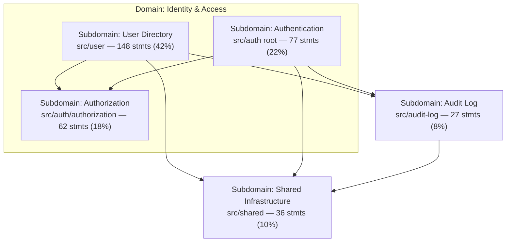

# Component Inventory: `src/user`, `src/auth`, `src/audit-log`, `src/shared`

Component identification and sizing using the **component-identification-sizing** skill.

**Context:** [Domain Analysis: User & Auth](./domain-analysis-user-auth.md)  
**Scope:** `src/user/`, `src/auth/`, `src/audit-log/`, `src/shared/` (production `.ts` only; excludes `*.spec.ts`)  
**Date:** 2026-05-20  
**Wired in app:** `AppModule` imports `UserModule`, `AuthModule`, `AuditLogModule`; global `AuthGuard` + `PermissionsGuard`

> **Note:** `src/identity/` exists as a parallel, richer IAM layout (domain layer, ports, events). It is **out of scope** for this inventory; metrics below reflect the four modules above only.

---

## Executive Summary

| Metric | Value |
|--------|-------|
| Source files (non-test) | 31 |
| Total statements | 350 |
| Logical components | 10 |
| Subdomains (domain-aligned) | 5 |
| Mean component size | 35 statements |
| Standard deviation | 43 statements |

This codebase is a **small reference implementation**. Percent-based thresholds flag relative imbalance; **absolute sizes are tiny** and do not yet justify physical service extraction.

**Largest concentration:** User Directory core (`user.service.ts` + `user.repository.ts` ≈ 112 statements, 32% of scoped code).  
**Structural note (from domain analysis):** Authentication and Authorization share `src/auth/` but partition cleanly at 77 vs 62 statements.

---

## Domain → Subdomain → Component Map



| Subdomain (domain analysis) | Path | Type | Statements | % of scope |
|-----------------------------|------|------|------------|------------|
| User Directory | `src/user/` | Supporting | 148 | 42.3% |
| Authentication | `src/auth/` (excl. `authorization/`) | Generic | 77 | 22.0% |
| Authorization | `src/auth/authorization/` | Supporting | 62 | 17.7% |
| Audit Log | `src/audit-log/` | Generic (cross-cutting) | 27 | 7.7% |
| Shared Infrastructure | `src/shared/` | Generic | 36 | 10.3% |

---

## Component Inventory (logical, non-overlapping)

Components are **leaf or core partitions** aligned with [domain-analysis-user-auth.md](./domain-analysis-user-auth.md). Parent folders with children are **subdomains**; children are components.

| Component | Path | Domain / Subdomain | Statements | Files | % | z-score | Status |
|-----------|------|-------------------|------------|-------|---|---------|--------|
| User Directory (core) | `src/user/` (excl. `dto/`) | User Directory | 136 | 4 | 38.9% | +2.34 | ⚠️ Too Large |
| Authentication | `src/auth/` (excl. `authorization/`, `dto/`) | Authentication | 75 | 6 | 21.4% | +0.93 | ✅ OK |
| Authorization | `src/auth/authorization/` | Authorization | 62 | 7 | 17.7% | +0.63 | ✅ OK |
| Shared: Hashing | `src/shared/hashing/` | Shared Infrastructure | 15 | 2 | 4.3% | -0.46 | ✅ OK |
| User DTOs | `src/user/dto/` | User Directory | 12 | 3 | 3.4% | -0.53 | ✅ OK |
| Shared: Database | `src/shared/database/` | Shared Infrastructure | 11 | 2 | 3.1% | -0.56 | ✅ OK |
| Shared: Swagger | `src/shared/swagger/` | Shared Infrastructure | 10 | 2 | 2.9% | -0.58 | ✅ OK |
| Audit Log (core) | `src/audit-log/` (excl. `events/`) | Audit Log | 21 | 3 | 6.0% | -0.32 | ✅ OK |
| Audit Events (contract) | `src/audit-log/events/` | Audit Log | 6 | 1 | 1.7% | -0.67 | ✅ OK |
| Auth DTOs | `src/auth/dto/` | Authentication | 2 | 1 | 0.6% | -0.76 | 🔍 Too Small |

**Status legend**

- ✅ **OK:** Within ~1–2σ of mean; cohesive functional area
- ⚠️ **Too Large:** >30% of scoped codebase (small-app threshold) or >2σ above mean
- 🔍 **Too Small:** <1% of codebase or <1σ below mean

**Thresholds used:** Small application (<10 logical components) → oversized if **>30%** or **>2σ**; undersized if **<1%** or **<1σ** below mean.

---

## Leaf Directory Components (structural)

Directories that contain `.ts` and have **no child directories** with source files:

| Leaf path | Files | Statements | Role |
|-----------|-------|------------|------|
| `src/user/dto/` | 3 | 12 | HTTP validation / API contracts |
| `src/auth/authorization/` | 7 | 62 | RBAC policy, guards, decorators |
| `src/auth/dto/` | 1 | 2 | Sign-in command DTO |
| `src/audit-log/events/` | 1 | 6 | `AUDIT_EVENT` payload contract |
| `src/shared/database/` | 2 | 11 | Prisma client + Nest module |
| `src/shared/hashing/` | 2 | 15 | Argon2 password hashing |
| `src/shared/swagger/` | 2 | 10 | OpenAPI setup + tags |

**Subdomains with root-level source files** (not leaf-only):

| Subdomain path | Root files | Statements (root only) |
|----------------|------------|------------------------|
| `src/user/` | `user.module`, `user.controller`, `user.service`, `user.repository` | 136 |
| `src/auth/` | `auth.module`, `auth.controller`, `auth.service`, `auth.repository`, `auth.guard`, `public.decorator` | 75 |
| `src/audit-log/` | `audit-log.module`, `audit-log.service`, `audit-log.repository` | 21 |

---

## Top Files by Statement Count

| Statements | File | Component |
|------------|------|-----------|
| 69 | `src/user/user.service.ts` | User Directory (core) |
| 43 | `src/user/user.repository.ts` | User Directory (core) |
| 32 | `src/auth/auth.guard.ts` | Authentication |
| 31 | `src/auth/authorization/permissions.guard.ts` | Authorization |
| 21 | `src/user/user.controller.ts` | User Directory (core) |
| 21 | `src/auth/auth.service.ts` | Authentication |
| 14 | `src/auth/authorization/policy-map.ts` | Authorization |
| 13 | `src/shared/hashing/hashing.service.ts` | Shared: Hashing |
| 12 | `src/auth/auth.module.ts` | Authentication |
| 11 | `src/audit-log/audit-log.service.ts` | Audit Log (core) |

`user.service.ts` and `user.repository.ts` together account for **~32%** of the scoped codebase.

---

## Size Distribution (by % of scoped statements)

```
User Directory (core)  ████████████████████████████████████████  39%
Authentication         █████████████████████                     21%
Authorization          █████████████████                         18%
Audit Log (total)      ███████                                  8%
Shared (total)         ██████████                              10%
User DTOs              ███                                      3%
Auth DTOs              ▌                                        1%
```

---

## Cross-Component Dependencies (integration view)

| From | To | Pattern | Cohesion (domain analysis) |
|------|-----|---------|----------------------------|
| User Directory | Authorization | Customer/Supplier (`@CheckPermissions`) | 6/10 |
| User Directory | Shared Hashing | Generic utility | — |
| User Directory | Audit Events | Event (`EventEmitter2` + `AUDIT_EVENT`) | 4/10 |
| Authentication | Shared Hashing, Database | Generic | — |
| Authentication | Audit Events | Event | 4/10 |
| Authentication | Authorization | Same Nest module; JWT `role` → `AbilityFactory` | 8/10 |
| User + Auth | Database (`PrismaService`) | Shared Kernel (same `User` table) | 7/10 |
| Audit Log | Database | Infrastructure | — |

---

## Size Analysis Summary

**Total components (logical):** 10  
**Total statements:** 350  
**Mean:** 35 statements  
**Standard deviation:** 43 statements  

### Oversized (relative)

| Component | Issue | Absolute context |
|-----------|-------|------------------|
| User Directory (core) | 38.9% of scope; z = +2.34 | 4 files, 136 statements — driven by service + repository |

No component exceeds **>2σ** except User Directory (core). No split is urgent at current scale.

### Well-sized

Authentication, Authorization, Audit Log, Shared subfolders, User DTOs — balanced for a reference monolith.

### Undersized

| Component | Note |
|-----------|------|
| Auth DTOs | Single `sign-in.dto.ts` (2 statements) — acceptable; merge only if DTO folder proliferation |

---

## Recommendations

### High priority — monitor, do not split yet

**User Directory (core)** (~39% of scope)

- **Current:** CRUD + hashing on create + audit emission in `UserService`; Prisma in `UserRepository`.
- **Issue:** Relative overweight vs other components; matches domain-analysis finding (duplicate `User` access vs `AuthRepository`).
- **Action when growing:**
  1. Extract **application** vs **persistence** if `user.service.ts` exceeds ~150 statements.
  2. Introduce ports (`IUserDirectory`, `IUserCredentialsReader`) before any service split (see domain analysis).
- **Not recommended now:** Separate deployable service or microservice extraction.

### Medium priority — structural clarity (aligns with domain analysis)

**`src/auth/` package**

- **Current:** Authentication (75 stmts) + Authorization (62 stmts) in one Nest module.
- **Recommendation:** Keep one module for this repo; when adding features, use folders `authentication/` and `authorization/` (or split Nest modules) to mirror linguistic boundaries.
- **Cohesion of combined `auth` package:** ~56% of scoped auth code; acceptable for reference size.

**Duplicate persistence**

- `user.repository.ts` (43 stmts) vs `auth.repository.ts` (4 stmts) — same `User` table, different projections.
- **Recommendation:** Shared port in `shared` or `user` only if codebase doubles; document boundary in code comments until then.

### Low priority — consolidation candidates

| Item | Recommendation |
|------|----------------|
| Auth DTOs | Leave as-is; optional merge into `auth.controller` adjacent file if folder noise increases |
| Audit Events | Keep as separate contract component — correct for event-based IAM → Audit integration |
| `UserRole` duplication in DTOs | Single source of truth (`@generated/prisma`) per domain analysis |

### Out of scope but relevant

**`src/identity/`** — larger, domain-rich variant (~78 TS files). If migration completes, re-run this inventory on `identity/` and deprecate `user/` + `auth/` paths.

---

## Decomposition Readiness

| Question | Assessment |
|----------|------------|
| Ready to extract microservices? | **No** — total scoped code ~350 statements; Shared Kernel on `User` table |
| First split candidate if product grows? | **User Directory** vs **Access Control** (Authentication + Authorization) per domain analysis Option B |
| First file to watch? | `user.service.ts` (69 statements, 20% of scope) |
| Fitness function suggestion | Alert if any logical component exceeds **30%** of scoped statements or **150** statements absolute |

---

## Methodology

1. **Component identification:** Leaf directories + core partitions per subdomain (exclude nested dirs from parent totals to avoid double counting).
2. **Statement counting:** Executable statements in `.ts` files; excludes tests, imports-only lines, bare type/class declarations, decorators-only lines, block comments.
3. **Statistics:** Mean, sample standard deviation, z-score per component.
4. **Domain alignment:** Subdomains and boundaries from [domain-analysis-user-auth.md](./domain-analysis-user-auth.md).

To reproduce metrics locally:

```bash
node scripts/component-sizing-v2.mjs
```

(Script partitions components without overlap; outputs JSON to stdout.)

---

## Analysis Checklist

**Component identification**

- [x] Mapped directory structure under `src/user`, `src/auth`, `src/audit-log`, `src/shared`
- [x] Distinguished subdomains (parents) vs leaf/core components
- [x] Aligned components to IAM subdomains from domain analysis
- [x] Documented namespace/path per component

**Size calculation**

- [x] Counted statements per component (non-test)
- [x] Counted files per component
- [x] Calculated percentage of scoped total
- [x] Calculated mean and standard deviation

**Size assessment**

- [x] Flagged User Directory (core) as relatively oversized
- [x] Flagged Auth DTOs as relatively undersized
- [x] Documented size distribution

**Recommendations**

- [x] Prioritized actions (monitor vs structural vs consolidate)
- [x] Linked to domain analysis issues (auth package split, duplicate repositories)

---

## Related Documentation

- [Domain Analysis: User & Auth](./domain-analysis-user-auth.md)
- [Authorization](./authorization.md)
- [JWT Authentication](./jwt-authentication.md)
- [Audit Log](./audit-log.md)
