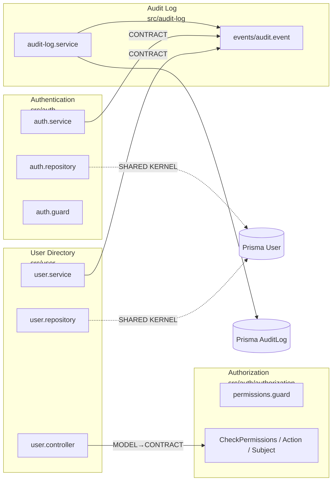

# Coupling Analysis: `src/user`, `src/auth`, `src/audit-log`

Three-dimensional coupling analysis (Integration Strength, Distance, Volatility) per the **coupling-analysis** skill and _Balancing Coupling in Software Design_ (Vlad Khononov).

**Context:** [Domain Analysis: User & Auth](./domain-analysis-user-auth.md), [Component Inventory](./component-inventory.md)  
**Shared Kernel (ownership):** [ADR — Prisma `User` table](./adr-shared-kernel-user.md)  
**Scope:** `src/user/`, `src/auth/` (Authentication + `authorization/`), `src/audit-log/`  
**Focus:** Dependencies flagged in domain analysis (User ↔ Auth persistence, User → Authorization, IAM → Audit Log, Auth ↔ Authorization runtime)  
**Date:** 2026-05-20

---

## Executive Summary

```
CODEBASE:           auth-patterns-ref (NestJS IAM reference)
MODULES ANALYZED:   4 logical modules (User Directory, Authentication, Authorization, Audit Log)
DEPENDENCIES MAPPED: 6 direct + 3 indirect (persistence / runtime)
CRITICAL ISSUES:    0
MODERATE ISSUES:    3
LOW ISSUES:         2

OVERALL HEALTH SCORE: Healthy (monolith-appropriate; watch items if splitting services)
```

| Module | Subdomain type | Volatility | Primary integration surface |
|--------|----------------|------------|-----------------------------|
| `src/user` | Supporting | Low | HTTP + Prisma `User` + events |
| `src/auth` (root) | Generic | Minimal | JWT + Prisma `User` + events |
| `src/auth/authorization` | Supporting | Low | Decorators/guards + `UserRole` |
| `src/audit-log` | Generic (cross-cutting) | Minimal | `AUDIT_EVENT` listener only |

**Balance formula (guiding principle):** `BALANCE = (STRENGTH XOR DISTANCE) OR NOT VOLATILITY`  
**Maintenance effort (per edge):** `STRENGTH × DISTANCE × VOLATILITY` (each dimension 0 = low, 1 = high)

No edge scores **CRITICAL** (high strength + high distance + high volatility). The reference monolith keeps volatile core elsewhere; IAM modules are Supporting/Generic with low volatility.

---

## Dependency Map

### Declared imports (compile-time)



### Annotated edges (strength)

```
[user.controller]     --[MODEL → published API]--> [auth/authorization]
[user.service]        --[CONTRACT]---------------> [audit-log/events]
[auth.service]        --[CONTRACT]---------------> [audit-log/events]
[user.repository]     --[SHARED KERNEL]---------> [Prisma User] <----- [auth.repository]
[auth.guard]          --[RUNTIME: sequential]----> [permissions.guard]  (via request.user)
[audit-log.service]   --[MODEL: meaning]-------> [AuditAction enum]   (implicit from publishers)
```

**Knowledge flow (upstream → downstream):**

| Upstream (exposes) | Downstream (consumes) | Mechanism |
|--------------------|----------------------|-----------|
| Authorization | User Controller | `@CheckPermissions`, `Action`, `Subject` |
| Audit events contract | User Service, Auth Service | `EventEmitter2` + `AuditEvent` |
| Prisma `User` schema | User + Auth repositories | Direct ORM access |
| AuthGuard (JWT verify) | PermissionsGuard | `request['user']` payload |
| Prisma `AuditAction` | Audit publishers (implicit) | String action codes in `AuditEvent` |

`audit-log` has **no imports** from `user` or `auth` — integration is inbound only (good direction).

---

## Domain-Analysis Flagged Dependencies (deep dive)

### 1. User Directory → Authorization (cohesion 6/10)

**Domain analysis:** Customer/Supplier; User module imports auth decorators.

| Dimension | Assessment | Score |
|-----------|------------|-------|
| **Strength** | **Model → Contract.** Downstream imports `Action`, `Subject`, `CheckPermissions` from `../auth/authorization` — intentional published language, not internal guard implementation. Still **connascence of name** on enums and decorator metadata shape. | Medium (0.5) |
| **Distance** | Same application; different packages (`src/user` vs `src/auth/authorization`). Nest: `UserModule` does **not** import `AuthModule`; only `UserController` pulls authorization symbols. | Low (0.25) |
| **Volatility** | Both Supporting subdomains; RBAC policy changes are infrequent relative to product core. | Low (0.25) |

**Balance:** 🟢 **GOOD** — strong-ish integration at low distance with low volatility (cohesion-friendly).

**Evidence:**

```14:14:src/user/user.controller.ts
import { Action, CheckPermissions, Subject } from '../auth/authorization';
```

```27:28:src/user/user.controller.ts
  @CheckPermissions({ action: Action.READ, subject: Subject.USER })
  findAll(@Query() query: FindAllUsersQueryDto) {
```

**Maintenance effort:** ~0.03 (low)

**Recommendation (medium priority, from domain analysis):**

- Keep Customer/Supplier direction (User → Authorization).
- If `user` must not depend on `auth` package path, introduce `IPermissionChecker` or a thin `permissions-api` barrel — **not required** at current size.
- When adding new protected resources, update `Subject` enum + `POLICY_MAP` + controllers — expect coordinated edits (functional coupling of policy vocabulary).

---

### 2. User Directory ↔ Authentication — shared `User` table (cohesion 7/10)

**Domain analysis:** Shared Kernel today; duplicate `UserRepository` vs `AuthRepository`.

| Dimension | Assessment | Score |
|-----------|------------|-------|
| **Strength** | **Model coupling** via Prisma `User` model. Not intrusive (no cross-module DB reads), but **two persistence adapters** on the same aggregate with different projections (`omit: passwordHash` vs full row). **Connascence of algorithm** on schema fields (`email`, `passwordHash`, `role`). | Medium–High (0.65) |
| **Distance** | Same monolith, separate folders; no direct TypeScript import between `user` and `auth`. | Medium (0.5) |
| **Volatility** | Authentication = Generic (minimal); User Directory = Supporting (low). | Low (0.25) |

**Balance:** 🟡 **ACCEPTABLE** for monolith — 🟠 **ATTENTION** if extracting microservices (strength × distance rises).

**Evidence:**

```10:14:src/user/user.repository.ts
  async findById(id: string) {
    return this.prisma.client.user.findUnique({
      where: { id },
      omit: { passwordHash: true },
```

```8:11:src/auth/auth.repository.ts
  async findByEmailWithPassword(email: string) {
    return this.prisma.client.user.findUnique({
      where: { email },
```

**Maintenance effort:** ~0.08 (moderate in monolith; becomes high when distributed)

**Recommendation (medium priority):**

- Document boundary: User Directory owns lifecycle; Authentication owns credential verification projection.
- Introduce ports `IUserDirectory` / `IUserCredentialsReader` before any physical split (domain analysis Option B).
- Do **not** merge repositories yet — separation of concerns is intentional.

---

### 3. IAM → Audit Log (cohesion 4/10)

**Domain analysis:** Cross-cutting; keep event-based; avoid direct service coupling.

| Dimension | Assessment | Score |
|-----------|------------|-------|
| **Strength** | **Contract coupling** for transport: `AuditEvent` + `AUDIT_EVENT` constant. **Model / meaning coupling** for `action` strings — publishers use `string`; consumer casts to `AuditAction` (Prisma enum). No compile-time link from `user`/`auth` to enum. | Low–Medium (0.4) |
| **Distance** | Separate module; async event bus (`EventEmitter2`); no DI into `AuditLogService` from publishers. | Medium (0.5) |
| **Volatility** | Audit = Generic (minimal); IAM = Supporting (low). | Low (0.25) |

**Balance:** 🟢 **GOOD** — loose, event-driven integration matches recommendation.

**Evidence (publishers — contract only):**

```62:65:src/user/user.service.ts
    this.eventEmitter.emit(
      AUDIT_EVENT,
      new AuditEvent('USER_UPDATED', id, performedBy ?? null, { changes }),
```

```37:40:src/auth/auth.service.ts
    this.eventEmitter.emit(
      AUDIT_EVENT,
      new AuditEvent('AUTH_LOGIN', user.id, user.id, { email: user.email }),
```

**Evidence (consumer — meaning connascence):**

```16:18:src/audit-log/audit-log.service.ts
      await this.auditLogRepository.create({
        action: event.action as AuditAction,
```

**Maintenance effort:** ~0.05 (low); rises if action vocabulary diverges

**Issue: Connascence of meaning (symmetric functional risk)**

| Publisher action | Must match `AuditAction` in schema |
|------------------|-----------------------------------|
| `USER_CREATED`, `USER_UPDATED`, `USER_DELETED` | ✅ |
| `AUTH_LOGIN` | ✅ |

Adding a new audited action requires: emit new string in IAM + add enum value in Prisma + handler tests — **no shared typed contract** today.

**Recommendation:**

- **Keep** event-based integration (do not inject `AuditLogService` into `UserService` / `AuthService`).
- **Improve contract:** export `AuditAction` type alias or const object from `audit-log/events` and use in publishers (contract coupling, eliminates string drift).
- Optional: versioned event payload schema if audit consumers multiply.

---

### 4. Authentication → Authorization (cohesion 8/10, same `auth/` package)

**Domain analysis:** Same Nest module; linguistic split recommended when growing.

| Dimension | Assessment | Score |
|-----------|------------|-------|
| **Strength** | **Runtime functional (sequential):** `AuthGuard` must run before `PermissionsGuard` to populate `request.user`. **Model coupling** on JWT claims (`sub`, `email`, `role`) consumed by `PermissionsGuard` / `AbilityFactory`. | Medium (0.5) |
| **Distance** | Same package (`src/auth/`); guards registered globally in `AppModule`. | Very low (0.1) |
| **Volatility** | Generic + Supporting; stable for reference repo. | Low (0.25) |

**Balance:** 🟢 **GOOD** — high strength acceptable at minimal distance (intentional cohesion).

**Evidence:**

```36:42:src/auth/auth.guard.ts
    try {
      const payload = await this.jwtService.verifyAsync<{
        sub: string;
        email: string;
        role: string;
      }>(token);
      request['user'] = payload;
```

```39:48:src/auth/authorization/permissions.guard.ts
    const request = context.switchToHttp().getRequest<Request>();
    const user = request['user'] as JwtPayload | undefined;
    // ...
    const ability = this.abilityFactory.createForRole(user.role);
```

**Note:** `role` typed as `string` in guard vs `UserRole` in `PermissionsGuard` — minor **connascence of type**; runtime safe if JWT issuer matches Prisma enum.

**Recommendation (medium priority, structural):**

- Folder split `authentication/` vs `authorization/` when adding features; keep shared minimal `JwtPayload` type in a `shared-kernel` file inside `auth`.
- Document guard order in `app.module` or README (sequential coupling).

---

### 5. `UserRole` spread (domain analysis: low priority)

**Symmetric functional coupling** across DTO, Prisma, JWT, and `POLICY_MAP` — not a direct module import edge but affects change propagation.

| Location | Definition |
|----------|------------|
| `prisma/schema.prisma` | `enum UserRole` (source of truth) |
| `src/user/dto/create-user.dto.ts` | Duplicate `enum UserRole` |
| `src/auth/authorization/policy-map.ts` | `UserRole` from `@generated/prisma` |
| JWT payload | `role` field (string at verify site) |

**Strength:** Functional (symmetric) + Model (duplicate enum)  
**Distance:** Low (same repo)  
**Volatility:** Low  

**Balance:** 🟡 **ACCEPTABLE**

**Recommendation:** Single source — import `UserRole` from `@generated/prisma` in DTOs; export shared `JwtPayload` interface with `role: UserRole`.

---

## Cross-Module Balance Matrix

Scaled dimensions: **S** = Strength, **D** = Distance, **V** = Volatility (0–1). **Diagnosis** from skill table.

| Edge | S | D | V | S×D×V | Diagnosis |
|------|---|---|---|-------|-----------|
| User → Authorization | 0.5 | 0.25 | 0.25 | 0.03 | 🟢 Good |
| User ↔ Auth (Prisma User) | 0.65 | 0.5 | 0.25 | 0.08 | 🟡 Acceptable / 🟠 if distributed |
| User → Audit (events) | 0.4 | 0.5 | 0.25 | 0.05 | 🟢 Good |
| Auth → Audit (events) | 0.4 | 0.5 | 0.25 | 0.05 | 🟢 Good |
| Auth → Authorization (runtime) | 0.5 | 0.1 | 0.25 | 0.01 | 🟢 Good (cohesion) |
| Audit → IAM (action enum) | 0.4 | 0.5 | 0.25 | 0.05 | 🟢 Good (implicit contract) |

---

## Issues by Severity

### Moderate

#### ISSUE: Duplicate persistence adapters on shared `User` aggregate

```
Modules:     user.repository ↔ auth.repository (indirect)
Coupling:    Model coupling + Shared Kernel (Prisma)
Connascence: Name, type, meaning (schema fields)
```

**Dimensions:** Strength HIGH-ish (0.65), Distance MEDIUM (0.5), Volatility LOW (0.25)  
**Balance:** 🟡 Acceptable in monolith

**Impact:** Schema or role semantics changes touch both repositories; risk of divergent query behavior (e.g. omit rules).

**Recommendation:** Ports + single schema owner; see domain analysis Option B.

---

#### ISSUE: Audit action strings without shared typed contract

```
Modules:     user.service, auth.service → audit-log.service
Coupling:    Contract (transport) + Model/meaning (action codes)
Connascence: Meaning (must match AuditAction enum)
```

**Dimensions:** Strength MEDIUM (0.4), Distance MEDIUM (0.5), Volatility LOW (0.25)  
**Balance:** 🟢 Good pattern, moderate drift risk

**Impact:** Typo or new action without Prisma migration fails at runtime in `audit-log.service` (caught in tests today).

**Recommendation:** Typed `AuditAction` re-export from `audit-log/events`; publishers import it.

---

#### ISSUE: User Controller depends on `auth/authorization` package path

```
Modules:     user.controller → auth/authorization
Coupling:    Model → Contract (published decorators)
```

**Dimensions:** Strength MEDIUM (0.5), Distance LOW (0.25), Volatility LOW (0.25)  
**Balance:** 🟢 Good (Customer/Supplier)

**Impact:** Authorization API changes (rename `Action`, guard behavior) require user controller updates.

**Recommendation:** Optional abstraction (`permissions-api`); align with domain analysis `IPermissionChecker` if boundaries harden.

---

### Low

#### ISSUE: JWT `role` typing inconsistency

`AuthGuard` uses `role: string`; `PermissionsGuard` expects `UserRole`. Works while issuer is `AuthService` only.

**Recommendation:** Shared `JwtPayload` type in `src/auth`.

---

#### ISSUE: Authentication + Authorization in one Nest module

Structural / linguistic, not a problematic **cross-package** coupling. Increases cognitive distance inside `auth/` but keeps runtime cohesion.

**Recommendation:** Folder split when codebase grows (component inventory + domain analysis).

---

## Positive Patterns

| Pattern | Location | Coupling type |
|---------|----------|---------------|
| Event-only IAM → Audit integration | `user.service`, `auth.service` emit; `audit-log` listens | Contract (transport) |
| Audit module isolation | No `user`/`auth` imports in `audit-log` | Downstream-only dependency rule |
| Password hash omission | `user.repository` `omit: { passwordHash: true }` | Encapsulation / least privilege |
| Published authorization API | `authorization/index.ts` barrel exports | Contract surface for consumers |
| Global guards in composition root | `app.module.ts` | Explicit wiring, not hidden imports |
| Fail-soft audit persist | `audit-log.service` try/catch + log | Decouples audit failure from IAM transaction |

---

## Volatility Notes

Git history for scoped paths is limited (young reference repo). Recent commits show **audit-log** and **authorization** introduced in focused feature commits — no sustained high churn yet.

| Signal | Inference |
|--------|-------------|
| Subdomain classification (domain analysis) | IAM = Supporting/Generic → low volatility |
| `TODO` / API versions | Not prevalent in scoped modules |
| Test coverage on audit emissions | Reduces regression risk for event contract |

**Inferred volatility coupling:** If a hypothetical **Core** product module were added with high churn, IAM modules would remain stable unless business rules for roles/audit actions change — current design tolerates that.

---

## Prioritized Recommendations

### High priority (before service extraction)

1. **Typed audit contract** — share `AuditAction` (or const map) from `audit-log/events`; remove stringly-typed emits in `user.service` / `auth.service`.
2. **Document Shared Kernel** — `User` table owned by User Directory; Auth is read-only credentials projection.

### Medium priority (architectural health)

3. **Ports for User persistence** — `IUserDirectory` + `IUserCredentialsReader` before splitting User vs Access Control (domain analysis Option B).
4. **Optional permission facade** — if `user` must not import from `auth/authorization` path.
5. **Split `auth/` folders** — `authentication/` vs `authorization/` when adding endpoints (no urgent coupling fix).

### Low priority

6. **Unify `UserRole`** — DTO enum → `@generated/prisma`.
7. **Shared `JwtPayload` interface** — align `AuthGuard` and `PermissionsGuard` types.

### Not recommended now

- Injecting `AuditLogService` into IAM services (would increase strength to intrusive/service coupling).
- Merging `UserRepository` and `AuthRepository` (loses projection boundary).
- Extracting `audit-log` to a separate deployable without versioned event contract.

---

## Integration with Component Inventory

| Component inventory finding | Coupling analysis confirmation |
|----------------------------|--------------------------------|
| User Directory 39% of scope | Largest change surface; pairs with User ↔ Auth Shared Kernel |
| Auth package 56% of auth code | Auth ↔ Authorization = low distance, good cohesion |
| Audit Events 6 stmts, separate | Correct **contract** component for IAM integration |
| Decomposition readiness: No microservices | Coupling matrix supports staying monolith |

---

## Analysis Checklist

**Structural mapping**

- [x] Module inventory for user, auth (authn + authz), audit-log
- [x] Dependency graph (compile-time + runtime)
- [x] Distance per edge (package / monolith / event bus)

**Integration strength**

- [x] Classified each flagged dependency (intrusive / functional / model / contract)
- [x] Identified connascence (name, type, meaning) where relevant

**Volatility**

- [x] Subdomain types from domain analysis applied
- [x] Git history noted (limited data)

**Balance & report**

- [x] Balance matrix and maintenance effort estimates
- [x] Issues by severity with recommendations
- [x] Positive patterns documented

---

## Source References

| File | Coupling role |
|------|---------------|
| `src/user/user.controller.ts` | User → Authorization (decorators) |
| `src/user/user.service.ts` | User → Audit events |
| `src/user/user.repository.ts` | Shared Kernel `User` |
| `src/auth/auth.service.ts` | Auth → Audit events |
| `src/auth/auth.repository.ts` | Shared Kernel `User` (credentials) |
| `src/auth/auth.guard.ts` | Auth → Authorization runtime (`request.user`) |
| `src/auth/authorization/*` | Published permission API |
| `src/audit-log/events/audit.event.ts` | Integration contract |
| `src/audit-log/audit-log.service.ts` | Event consumer + `AuditAction` cast |
| `src/app.module.ts` | Global guards + `EventEmitterModule` |
| `prisma/schema.prisma` | `User`, `UserRole`, `AuditAction` |

---

## Related Documentation

- [Domain Analysis: User & Auth](./domain-analysis-user-auth.md)
- [Component Inventory](./component-inventory.md)
- [Authorization](./authorization.md)
- [JWT Authentication](./jwt-authentication.md)
- [Audit Log](./audit-log.md)
