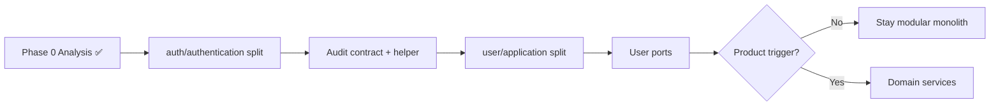

# Decomposition Planning & Roadmap: IAM (`user`, `auth`, `audit-log`, `shared`)

Step-by-step decomposition plan and migration roadmap from monolith toward a service-ready layout. Uses the **decomposition-planning-roadmap** skill and synthesizes prior analyses in `docs/`.

**Inputs:** [Domain Analysis](./domain-analysis-user-auth.md), [Component Inventory](./component-inventory.md), [Coupling Analysis](./coupling-analysis-user-auth.md), [Common Domain Detection](./common-domain-detection-user-auth.md), [Component Flattening](./component-flattening-analysis-user-auth.md), [Domain Identification & Grouping](./domain-identification-grouping-user-auth.md)  
**Scope:** `src/user/`, `src/auth/`, `src/audit-log/`, `src/permissions-api/`, `src/shared/` · `src/identity/` **deprecated** ([identity-stack-decision.md](./identity-stack-decision.md))  
**Date:** 2026-05-20

---

## Executive Summary

```
CODEBASE SIZE:           ~350 production statements (reference monolith)
PATTERNS COMPLETE:       5 / 6 (analysis); 0 / 6 (physical service extraction)
NEXT CRITICAL PATH:      Flatten auth → Consolidate contracts → Namespace alignment
SERVICE EXTRACTION:      Deferred (feasibility: monolith-appropriate per coupling)
TARGET STATE (12 mo):    Modular monolith with clear domain boundaries, optional Audit split
```

| Recommendation | Verdict |
|----------------|---------|
| Continue decomposition **inside the monolith** | ✅ Yes — high value, low risk |
| Extract microservices now | ❌ No — Shared Kernel on `User` table; tiny surface |
| First executable work | `src/auth/authentication/` split + `UserRole` SSOT |
| Gate for Pattern 6 | Ports + versioned audit contract + product scale trigger |

This repo is a **small reference implementation**. Timelines below use **sprints (1–2 weeks)** rather than multi-month enterprise schedules. Adjust if the codebase grows toward production size.

---

## Current State Assessment

### Decomposition pattern sequence (component-based)

| # | Pattern | Skill / artifact | Status | Progress | Notes |
|---|---------|------------------|--------|----------|-------|
| 1 | Identify and size components | [component-inventory.md](./component-inventory.md) | ✅ Complete | 100% | 10 logical components; User Directory relatively large |
| 2 | Gather common domain components | [common-domain-detection-user-auth.md](./common-domain-detection-user-auth.md) | ✅ Complete | 100% | 3 consolidation candidates; 4 explicit do-not-merge |
| 3 | Flatten components | [component-flattening-analysis-user-auth.md](./component-flattening-analysis-user-auth.md) | ⚠️ Analysis only | 40% | Plan ready; **no code moves yet** |
| 4 | Determine component dependencies | [coupling-analysis-user-auth.md](./coupling-analysis-user-auth.md) | ✅ Complete | 100% | Healthy monolith; 0 critical coupling issues |
| 5 | Create component domains | [domain-identification-grouping-user-auth.md](./domain-identification-grouping-user-auth.md) | ✅ Complete | 85% | 3 domains, 10/10 assigned; namespace refactor pending |
| 6 | Create domain services | — | ❌ Not started | 0% | **Blocked** by scale + Shared Kernel; not needed for reference goal |

### Key findings (synthesis)

| Area | Finding | Source |
|------|---------|--------|
| Size | 31 files, 350 statements; mean component 35 stmts | Inventory |
| Domains | IAM (82%), Audit (8%), Shared (10%) | Domain grouping |
| Coupling | No CRITICAL edges; event-based audit is correct | Coupling |
| Duplication | Audit emit boilerplate; `UserRole` enum spread; dual User repos | Common domain |
| Structure | 13 orphaned files at `user/`, `auth/`, `audit-log/` roots | Flattening |
| Extraction | First *logical* split: User Directory vs Access Control (Option B) | Domain analysis |
| ~~Parallel code~~ | **Resolved (Story 8):** deprecate `src/identity/`; active stack only | [identity-stack-decision.md](./identity-stack-decision.md) |

### What remains before Pattern 6

1. Execute **flattening** (especially `auth/authentication/`).
2. Apply **consolidation** wins (typed audit contract, `UserRole` SSOT, audit publish helper).
3. Introduce **ports** for User persistence if splitting IAM subdomains or services.
4. Optional **Strategy B** namespaces (`src/iam/`) only when extraction is imminent.
5. **Stakeholder / product trigger** for deployable services (scale, team topology, SLO).

---

## Feasibility Gate (Pattern 6)

Do **not** start domain service extraction until **all** gates pass:

| Gate | Current | Required to proceed |
|------|---------|---------------------|
| G1 — Bounded context clarity | ✅ IAM + Audit + Shared documented | Maintain domain map |
| G2 — Low-risk integration surfaces | ⚠️ Audit strings; dual repos | Versioned `AuditEvent` + ports |
| G3 — Physical boundaries match logical | ❌ Authn at `auth/` root | `authentication/` leaf complete |
| G4 — Coupling health | ✅ No critical issues | Re-run coupling after refactors |
| G5 — Business driver | ❌ Reference-only | Independent deploy/scaling need |
| G6 — Shared Kernel strategy | ⚠️ Same Prisma `User` | Split schema ownership or ACL API |

**Verdict today:** Proceed with **Phase 1–2** (modular monolith). **Phase 3** (service extraction) is **optional / future**.

---

## Prioritized Work Plan

Scoring: `Priority = (Value × 3) − (Risk × 2) − (Dependencies × 1)`  
Scale: **3** = High, **2** = Medium, **1** = Low.

### High priority (do first)

| # | Work item | V | R | D | Score | Effort |
|---|-----------|---|---|---|-------|--------|
| 1 | Split `src/auth/authentication/` (flatten + domain alignment) | 3 | 1 | 1 | **6** | 0.5–1 day |
| 2 | Typed audit contract + publish helper in `audit-log/events` | 3 | 1 | 1 | **6** | 1–2 days |
| 3 | `UserRole` single source of truth (`@generated/prisma`) | 2 | 1 | 1 | **3** | 0.5 day |

### Medium priority (next)

| # | Work item | V | R | D | Score | Effort |
|---|-----------|---|---|---|-------|--------|
| 4 | Split `src/user/application/` (flatten) | 2 | 1 | 2 | **2** | 2–4 h |
| 5 | Ports: `IUserDirectory` + `IUserCredentialsReader` | 3 | 2 | 2 | **3** | 2–3 days |
| 6 | Document Shared Kernel (`User` table ownership) | 2 | 1 | 1 | **3** | 0.5 day |
| 7 | Optional `IPermissionChecker` facade (user → authz) | 2 | 2 | 2 | **0** | 1–2 days |

### Low priority (later / when growing)

| # | Work item | V | R | D | Score | Effort |
|---|-----------|---|---|---|-------|--------|
| 8 | `audit-log/persistence/` leaf (cosmetic flatten) | 1 | 1 | 2 | **-1** | 2–4 h |
| 9 | `src/iam/` top-level rename (Strategy B) | 2 | 2 | 3 | **-1** | 1–2 days |
| 10 | Split `user.service` if >150 statements | 2 | 2 | 3 | **-2** | 3–5 days |

### Defer / avoid

| Work item | Why defer |
|-----------|-----------|
| Extract IAM microservice | Shared Kernel on `User`; 287 stmts; coupling matrix says stay monolith |
| Extract Audit microservice | 27 stmts; needs versioned contract + ops overhead |
| Merge `UserRepository` + `AuthRepository` | Breaks projection boundary ([common domain](./common-domain-detection-user-auth.md)) |
| Inject `AuditLogService` into IAM | Intrusive coupling ([coupling](./coupling-analysis-user-auth.md)) |
| Consolidate `auth` + `authorization` into one folder | Blurs subdomains |

### Prioritization matrix

```
                    Low Risk              High Risk
              ┌─────────────────────┬─────────────────────┐
   High Value  │ DO FIRST            │ DO CAREFULLY        │
              │ • auth/authentication│ • Ports before split │
              │ • audit contract    │ • identity migration │
              │ • UserRole SSOT     │                     │
              ├─────────────────────┼─────────────────────┤
   Low Value   │ DO LATER            │ AVOID / DEFER       │
              │ • user/application  │ • Microservice extract│
              │ • audit persistence │ • merge repositories │
              └─────────────────────┴─────────────────────┘
```

---

## Phased Roadmap

### Phase 0: Analysis complete ✅ (done)

**Goal:** Understand components, coupling, domains, and consolidation options.

**Deliverables (all in `docs/`):**

- Domain analysis, component inventory, coupling, common domain, flattening, domain grouping

**Milestone:** Architecture baseline approved for implementation sprints.

**Duration:** Completed 2026-05-20.

---

### Phase 1: Modular monolith preparation (Sprints 1–2)

**Goal:** Clean structure and shared contracts without changing runtime behavior.

**Patterns:** Complete Pattern 3 (execute); partial Pattern 2 (consolidate); reinforce Pattern 4–5 in code.

| Sprint | Work | Milestone | Deliverable |
|--------|------|-----------|-------------|
| **1** | Story 1: `auth/authentication/` split + merge Auth DTO | Authn/authz visible in tree | PR + green tests |
| **1** | Story 2: `UserRole` SSOT | No duplicate enum in DTOs | PR |
| **2** | Story 3: Audit typed contract + publish helper | Single emit path | PR + fitness grep |
| **2** | Story 4: Document Shared Kernel in `docs/` or ADR | Ownership of `User` table clear | Doc commit |

**Success criteria:**

- [ ] No authentication business files at `src/auth/` root (composer-only exception documented)
- [ ] IAM publishers use audit helper only
- [ ] `npm test` / CI green
- [ ] Re-run `node scripts/component-sizing-v2.mjs` (optional metrics refresh)

**Estimated duration:** 1–2 weeks (part-time) · **Risk:** Low

---

### Phase 2: Domain-aligned structure (Sprints 3–4)

**Goal:** Physical layout matches IAM / Audit / Shared domains.

**Patterns:** Complete Pattern 5 namespace alignment; optional Pattern 3 remainder.

| Sprint | Work | Milestone | Deliverable |
|--------|------|-----------|-------------|
| **3** | Story 5: `user/application/` split | User root has no orphans | PR |
| **3** | Story 6: Domain namespace governance (eslint/script) | CI fails on cross-domain violations | Fitness function |
| **4** | Story 7: Ports for User read/write projections | Auth repo implements credentials port | Interfaces + adapters |
| **4** | Story 8 (optional): `IPermissionChecker` | User controller decoupled from authz path | Facade PR |

**Success criteria:**

- [ ] Domain map in [domain-identification-grouping](./domain-identification-grouping-user-auth.md) matches `src/` tree
- [ ] Coupling re-assessment: User → Authorization still Customer/Supplier
- [ ] No new direct IAM → `audit-log.service` imports

**Estimated duration:** 2–3 weeks · **Risk:** Low–medium

**Defer to Phase 2+:** `src/iam/` rename unless extraction scheduled.

---

### Phase 3: Extraction readiness (Sprints 5–8, optional)

**Goal:** Make bounded contexts deployable **if** product requires it — not mandatory for reference repo.

**Pattern:** Pattern 6 preparation only (API boundaries, contracts), not full extraction unless G5 passes.

| Sprint | Work | Trigger | Outcome |
|--------|------|---------|---------|
| **5–6** | Define OpenAPI/event schemas for Audit + IAM integration | Audit compliance scope | Contract repo or package |
| **6–7** | Split Nest modules: `UserDirectoryModule`, `AccessControlModule` | Team parallel work | Logical services in one deploy |
| **7–8** | POC: Audit as separate process (same DB or outbox) | Independent scaling | Learn operational cost |

**First extraction candidate (if ever):** **Audit** — inbound-only, 27 stmts, clear event contract ([domain grouping](./domain-identification-grouping-user-auth.md)).

**Second candidate:** **Access Control** (Authentication + Authorization) — 139 stmts; needs JWT + policy API.

**Last candidate:** **User Directory** — 148 stmts; owns `User` Shared Kernel.

**Estimated duration:** 4–8 weeks (only if product-driven) · **Risk:** High

---

### Phase 4: Optimization & refinement (ongoing)

**Goal:** Sustain boundaries as codebase grows.

| Activity | Frequency |
|----------|-----------|
| Re-run component sizing | When any component >30% scope or >150 stmts |
| Re-run coupling analysis | After new cross-module imports |
| ~~Review `identity/` vs `user`+`auth`~~ | **Done** — single stack `user`+`auth` |
| Update this roadmap | Each quarter or after major refactor |

---

## Critical Path



**Blocking chain:** Flatten auth → audit contract → (optional) user application → ports → **gate** → service extraction.

---

## Architecture Stories

### Story 1: Flatten Authentication subdomain

**As an architect**, I need to move authentication files into `src/auth/authentication/`  
to support clear IAM subdomain boundaries  
so that Authentication and Authorization are leaf components and match the domain map.

**Acceptance criteria:**

- [ ] `auth.service`, `auth.controller`, `auth.repository`, `auth.guard`, `public.decorator`, `sign-in.dto` live under `authentication/`
- [ ] `authorization/` unchanged
- [ ] `app.module.ts` imports updated; tests green
- [ ] [Flattening checklist](./component-flattening-analysis-user-auth.md#execution-checklist-when-implementing) post-flatten items checked

**Estimate:** 3 story points (~0.5–1 day)  
**Priority:** High · **Dependencies:** None  
**Refs:** [Flattening § High priority](./component-flattening-analysis-user-auth.md), [Domain grouping § High](./domain-identification-grouping-user-auth.md)

---

### Story 2: Single source of truth for UserRole

**As an architect**, I need to remove duplicate `UserRole` enums from DTOs  
to support consistent identity vocabulary across IAM  
so that policy, JWT, and HTTP layers cannot drift.

**Acceptance criteria:**

- [ ] `create-user.dto` (and others) import `UserRole` from `@generated/prisma` or shared IAM contract
- [ ] No `export enum UserRole` under `src/user/dto`
- [ ] Policy map and guards unchanged in behavior

**Estimate:** 2 story points (~0.5 day)  
**Priority:** High · **Dependencies:** None  
**Refs:** [Common domain — UserRole](./common-domain-detection-user-auth.md), [Domain analysis — Low issue](./domain-analysis-user-auth.md)

---

### Story 3: Audit publish helper and typed contract

**As an architect**, I need a single audit publishing API and typed action codes  
to support safe IAM → Audit integration  
so that publishers do not duplicate emit logic or use stringly-typed actions.

**Acceptance criteria:**

- [ ] Helper (e.g. `publishAudit(eventEmitter, payload)`) used by `user.service` and `auth.service`
- [ ] `AuditAction` or const map exported from `audit-log/events`
- [ ] Fitness grep: no raw `eventEmitter.emit(AUDIT_EVENT` outside helper
- [ ] Existing audit tests pass

**Estimate:** 3 story points (1–2 days)  
**Priority:** High · **Dependencies:** None (can parallel Story 1)  
**Refs:** [Coupling — high priority #1](./coupling-analysis-user-auth.md), [Common domain — Group A](./common-domain-detection-user-auth.md)

---

### Story 4: Document User table Shared Kernel

**As an architect**, I need documented ownership of the Prisma `User` model  
to support future service splits  
so that teams know which context owns schema migrations.

**Acceptance criteria:**

- [ ] ADR or section in `docs/coding-patterns.md`: User Directory owns `User`; Auth uses credentials projection only
- [ ] Linked from domain analysis and coupling docs

**Estimate:** 1 story point (~2 h)  
**Priority:** Medium · **Dependencies:** None

---

### Story 5: Flatten User Directory application leaf

**As an architect**, I need user core files under `src/user/application/`  
to support strict component hierarchy  
so that `src/user/` root has no orphaned production files.

**Acceptance criteria:**

- [ ] `user.module`, `user.controller`, `user.service`, `user.repository` under `application/`
- [ ] `dto/` remains sibling leaf
- [ ] `AppModule` import path updated

**Estimate:** 2 story points (2–4 h)  
**Priority:** Medium · **Dependencies:** Story 1 recommended first (consistent IAM layout)

---

### Story 6: Domain boundary fitness function

**As an architect**, I need automated checks for cross-domain imports  
to support long-term modular monolith health  
so that IAM does not depend on Audit internals beyond `events/`.

**Acceptance criteria:**

- [ ] Script or ESLint rule encodes rules from [domain grouping — governance](./domain-identification-grouping-user-auth.md#cross-domain-access-rules-governance)
- [ ] CI step fails on violations
- [ ] Documented allowlist for `audit-log/events`, `shared/*`

**Estimate:** 5 story points (1 week)  
**Priority:** Medium · **Dependencies:** Stories 1, 3

---

### Story 7: User persistence ports

**As an architect**, I need `IUserDirectory` and `IUserCredentialsReader` ports  
to support splitting User Directory from Access Control  
so that repositories are not duplicated without a boundary.

**Acceptance criteria:**

- [ ] Ports defined; `UserRepository` / `AuthRepository` implement respective interfaces
- [ ] No merge of password hash projection rules
- [ ] Unit tests mock ports

**Estimate:** 5 story points (2–3 days)  
**Priority:** Medium · **Dependencies:** Phase 1 complete  
**Refs:** [Domain analysis Option B](./domain-analysis-user-auth.md), [Common domain — ports](./common-domain-detection-user-auth.md)

---

### Story 8: Resolve identity parallel stack (spike) — **Done**

**As an architect**, I need a decision on `src/identity/` vs `src/user`+`src/auth`  
to support a single IAM decomposition path  
so that future work does not duplicate guards, audit, and authorization.

**Acceptance criteria:**

- [x] Written decision: **deprecate** `src/identity/` — [identity-stack-decision.md](./identity-stack-decision.md)
- [ ] If migrate: ordered epic list (not full execution in spike)

**Estimate:** 3 story points (1–2 days spike)  
**Priority:** Medium · **Dependencies:** None · **Risk:** Strategic

---

### Story 9: Extract Audit domain service (future)

**As an architect**, I need Audit as an independently deployable service  
to support separate scaling/compliance lifecycle  
so that IAM publishes versioned events only.

**Acceptance criteria:**

- [ ] Phase 3 feasibility gate G1–G6 passed
- [ ] Versioned event schema; consumer in audit service
- [ ] No direct DB coupling from IAM to `AuditLog` table
- [ ] Rollback plan documented

**Estimate:** 13 story points (3+ weeks)  
**Priority:** Low (defer) · **Dependencies:** Stories 1–7, product trigger G5

---

### Story 10: Extract Access Control service (future)

**As an architect**, I need Authentication + Authorization as a deployable unit  
to support central IAM for multiple products  
so that User Directory exposes identity claims API only.

**Acceptance criteria:**

- [ ] JWT issuance/validation outside User Directory deployable
- [ ] Shared Kernel reduced to `JwtPayload` + role claims API
- [ ] Coupling re-analysis shows no CRITICAL edges

**Estimate:** 13+ story points  
**Priority:** Low (defer) · **Dependencies:** Story 7, Story 9 learnings

---

## Progress Dashboard

### Pattern completion

| Pattern | Status | Progress | Blocker |
|---------|--------|----------|---------|
| 1 — Identify & size | ✅ Complete | 100% | — |
| 2 — Common domain | ✅ Analysis / ⚠️ Implementation | 50% | Stories 2–3 |
| 3 — Flatten | ⚠️ In progress | 40% | Story 1, 5 not executed |
| 4 — Dependencies | ✅ Complete | 100% | — |
| 5 — Domains | ✅ Analysis / ⚠️ Namespaces | 85% | Story 1, 5, 6 |
| 6 — Domain services | ❌ Not started | 0% | Feasibility gate G5–G6 |

### Story status (snapshot)

| Status | Count | Stories |
|--------|-------|---------|
| Not started | 10 | 1–10 (implementation backlog) |
| In progress | 0 | — |
| Complete | 0 | — |

*Update this table as stories close.*

### Key metrics

| Metric | Baseline (2026-05-20) | Target after Phase 1 | Target after Phase 2 |
|--------|----------------------|------------------------|----------------------|
| Components identified | 10 | 10–11 (auth DTO merged) | 10–12 |
| Components refactored (structure) | 0 | 2–3 (authn, audit helper) | 5–6 |
| Domains documented | 3 | 3 | 3 |
| Domains namespace-aligned | ~33% (shared only) | ~66% | ~100% |
| Services extracted | 0 | 0 | 0 |
| Orphaned production files | 13 | ≤3 (composer exceptions) | 0–1 |
| Critical coupling issues | 0 | 0 | 0 |

### Blockers and risks

| ID | Blocker / risk | Mitigation | Owner |
|----|----------------|------------|-------|
| ~~B1~~ | ~~`src/identity/` dual stack~~ | **Closed** — deprecate; stack = `user`+`auth` | — |
| B2 | Shared Kernel `User` table | Story 4 + Story 7 ports | Dev |
| B3 | No product driver for microservices | Keep modular monolith; revisit gate G5 | Product |
| B4 | Reference size masks extraction cost | Do not extract until metrics exceed thresholds | Architect |

---

## Decision Log (roadmap)

| Date | Decision | Rationale |
|------|----------|-----------|
| 2026-05-20 | Prioritize modular monolith over microservices | ~350 stmts; coupling healthy; inventory says no extract now |
| 2026-05-20 | Auth `authentication/` split before service extraction | Unblocks Pattern 3 + 5; low risk |
| 2026-05-20 | Audit service first *if* extracting | Inbound-only, smallest domain ([grouping](./domain-identification-grouping-user-auth.md)) |
| 2026-05-20 | Do not merge User + Auth repositories | Coupling + common domain explicit do-not |

---

## Re-run Triggers

Re-generate or extend this roadmap when:

- Any logical component exceeds **30%** of scoped statements or **150** statements absolute ([inventory](./component-inventory.md))
- New cross-domain imports appear (fail fitness function)
- ~~`src/identity/` wired into `AppModule`~~ (rejected — not in scope)
- Production deployment requires independent IAM or Audit scaling
- Major Nest/Prisma upgrade changes guard or schema boundaries

**Commands:**

```bash
node scripts/component-sizing-v2.mjs
npm test
```

---

## Analysis Checklist (skill)

**Current state assessment**

- [x] Reviewed component inventory
- [x] Checked common component analysis
- [x] Assessed component structure (flattening doc)
- [x] Reviewed dependency / coupling analysis
- [x] Checked domain identification & grouping
- [x] Assessed service extraction status (none; gated)

**Pattern identification**

- [x] Patterns 1, 2, 4, 5 analysis complete
- [x] Pattern 3 plan complete, execution pending
- [x] Pattern 6 identified as deferred

**Prioritization**

- [x] Risk / value / dependencies scored
- [x] Priority formula applied
- [x] Prioritization matrix documented

**Roadmap creation**

- [x] Phases 0–4 defined
- [x] Milestones and deliverables per phase
- [x] Timeline scaled to reference repo size
- [x] Critical path diagram

**Story generation**

- [x] Architecture stories with acceptance criteria
- [x] Effort estimates (story points)
- [x] Dependencies listed

**Progress tracking**

- [x] Pattern dashboard
- [x] Metrics baselines
- [x] Blockers identified

---

## Related Documentation

| Analysis | Document |
|----------|----------|
| Strategic DDD | [domain-analysis-user-auth.md](./domain-analysis-user-auth.md) |
| Components & size | [component-inventory.md](./component-inventory.md) |
| Coupling | [coupling-analysis-user-auth.md](./coupling-analysis-user-auth.md) |
| Duplication | [common-domain-detection-user-auth.md](./common-domain-detection-user-auth.md) |
| Hierarchy | [component-flattening-analysis-user-auth.md](./component-flattening-analysis-user-auth.md) |
| Domains | [domain-identification-grouping-user-auth.md](./domain-identification-grouping-user-auth.md) |
| Feature docs | [authorization.md](./authorization.md), [jwt-authentication.md](./jwt-authentication.md), [audit-log.md](./audit-log.md) |

---

## Next Steps (immediate)

1. **Review this roadmap** with team — confirm Phase 1 scope for next sprint.
2. **Implement Story 1** (`auth/authentication/`) — highest priority, unblocks structure.
3. **Parallel or follow with Story 2–3** — `UserRole` + audit helper (low risk, high clarity).
4. **Update progress dashboard** in this file when stories complete.
5. **Re-run coupling + sizing** after Phase 1 merge.
