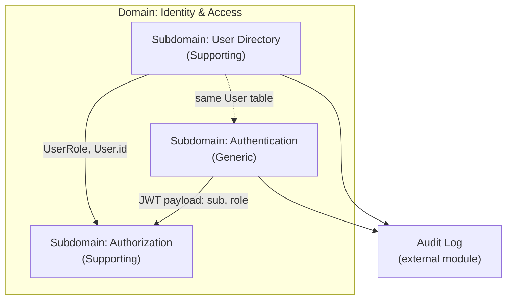

# Domain Analysis: `src/user` and `src/auth`

Strategic DDD analysis of the User and Auth modules. Generated using the **domain-analysis** skill.

**Scope:** `src/user/`, `src/auth/` (including `authorization/`)

**Date:** 2026-05-20

**Shared Kernel (ownership):** [ADR — Prisma `User` table](./adr-shared-kernel-user.md)

---

## Executive Summary

Both modules belong to a single parent domain: **Identity & Access Management (IAM)**.

| Subdomain | Module(s) | Type | Cohesion |
|-----------|-----------|------|----------|
| User Directory | `src/user` | Supporting | 9/10 |
| Authentication | `src/auth` (sign-in, JWT, guard) | Generic | 7/10 |
| Authorization | `src/auth/authorization` | Supporting | 8/10 |

This repository is a **reference implementation** for auth patterns, not a product with a competitive business core. IAM is Supporting/Generic relative to a hypothetical product core elsewhere.

---

## Domain: Identity & Access

**Type:** Supporting domain (Generic subdomains inside)

**Ubiquitous Language:** User, Role, Credentials, Sign-in, Access Token, Permission, Action, Subject, Ability, Policy

**Business Capability:** Manage accounts, authenticate sessions via JWT, and authorize operations by role.

### Architecture Overview



---

## Subdomain 1: User Directory

**Location:** `src/user/`

**Type:** Supporting Subdomain

**Ubiquitous Language:** User, fullName, email, password, role, create, update, delete, list, search

**Business Capability:** Administrative lifecycle of user accounts (CRUD, email uniqueness, password hashing on create, audit trail).

### Key Concepts

| Concept | Kind | Description |
|---------|------|-------------|
| User | Entity (persisted) | Account with identity, credential hash, and role |
| UserService | Application service | CRUD, email uniqueness, hashing on create, audit events |
| UserRepository | Persistence adapter | Prisma access; omits `passwordHash` on reads |
| UserController | HTTP entry point | REST `/user` with permission checks |

### Business Operations

- Create user (unique email, password hash, role assignment)
- List users (pagination, search by name/email)
- Update profile and role
- Delete user
- Emit audit events: `USER_CREATED`, `USER_UPDATED`, `USER_DELETED`

### Suggested Bounded Context: `UserDirectoryContext`

- **Linguistic boundary:** "User" = administrable record (profile, email, role, stored password hash).
- **Integration:**
  - Consumes **Authorization** via `@CheckPermissions` (Customer/Supplier).
  - Uses **Hashing** from `shared/hashing` (Generic).
  - Publishes audit events to **Audit Log** (event-based).

### Dependencies

- → `auth/authorization` — `Action`, `Subject`, `CheckPermissions`
- → `shared/hashing` — `HashingService`
- → `audit-log` — `AuditEvent` via `EventEmitter2`

### Cohesion Score: 9/10

| Criterion | Score | Notes |
|-----------|-------|-------|
| Linguistic cohesion | 3/3 | Single user-directory vocabulary |
| Usage cohesion | 3/3 | CRUD and audit used together |
| Data cohesion | 2/2 | Single `User` aggregate/table |
| Change cohesion | 1/2 | Role changes also affect auth policies |
| **Total** | **9/10** | High cohesion |

---

## Subdomain 2: Authentication

**Location:** `src/auth/` (excluding `authorization/` for conceptual boundary)

**Type:** Generic Subdomain

**Ubiquitous Language:** Sign-in, credentials, password validation, access token, Bearer, JWT payload (`sub`, `email`, `role`), public route

**Business Capability:** Verify credentials and issue JWT access tokens; validate tokens on protected routes.

### Key Concepts

| Concept | Kind | Description |
|---------|------|-------------|
| AuthService | Application service | Validates credentials, signs JWT, emits `AUTH_LOGIN` audit |
| AuthRepository | Persistence adapter | Loads user **with** `passwordHash` for sign-in |
| AuthGuard | HTTP guard | Verifies Bearer token, attaches `request.user` |
| SignInDto | Command DTO | email + password |
| Public decorator | Infrastructure | Marks routes that skip authentication |

### Suggested Bounded Context: `AuthenticationContext`

- **Linguistic boundary:** "User" = authenticated principal (claims in token), not the administrative record.
- **Integration:**
  - Reads persisted identity (shared `User` table today).
  - Downstream of persistence; upstream to **Authorization** via JWT `role`.

### Dependencies

- → Prisma `User` table (shared with User Directory)
- → `shared/hashing` — password verification
- → `@nestjs/jwt` — token sign/verify
- → `audit-log` — `AUTH_LOGIN`

### Cohesion Score: 7/10

| Criterion | Score | Notes |
|-----------|-------|-------|
| Linguistic cohesion | 3/3 | Clear authentication vocabulary |
| Usage cohesion | 2/3 | Sign-in cohesive; guard is cross-cutting |
| Data cohesion | 1/2 | Same `User` entity as User Directory |
| Change cohesion | 1/2 | JWT strategy changes affect whole app |
| **Total** | **7/10** | Medium-high |

---

## Subdomain 3: Authorization

**Location:** `src/auth/authorization/`

**Type:** Supporting Subdomain (policy rules are application-specific)

**Ubiquitous Language:** Permission, Action, Subject, Ability, Policy, Role (ADMIN, MANAGER, USER)

**Business Capability:** Enforce role-based access control (RBAC) on HTTP handlers.

### Key Concepts

| Concept | Kind | Description |
|---------|------|-------------|
| POLICY_MAP | Business policy | Role → list of action/subject permissions |
| AbilityFactory | Domain service | Builds `Ability` for a given `UserRole` |
| PermissionsGuard | HTTP guard | Enforces `@CheckPermissions` metadata |
| CheckPermissions | Decorator | Declares required action/subject on handler |
| Action / Subject enums | Ubiquitous language | CRUD actions on `User` subject |

### Policy Map (current)

| Role | Permissions |
|------|-------------|
| ADMIN | CREATE, READ, UPDATE, DELETE on USER |
| MANAGER | CREATE, READ, UPDATE on USER |
| USER | READ on USER |

### Suggested Bounded Context: `AuthorizationContext`

- **Linguistic boundary:** "Can perform action X on subject Y" — independent of how identity was proven.
- **Integration:** Consumes `role` from JWT payload (Authentication); consumed by User Controller and other protected routes.

### Dependencies

- → `UserRole` from Prisma/generated types
- → JWT payload on `request.user` (set by AuthGuard)

### Cohesion Score: 8/10

| Criterion | Score | Notes |
|-----------|-------|-------|
| Linguistic cohesion | 3/3 | Consistent RBAC/CASL-like vocabulary |
| Usage cohesion | 3/3 | Factory, guard, decorator, policy used together |
| Data cohesion | 1/2 | Tied to `UserRole` in persistence model |
| Change cohesion | 1/2 | New subjects/actions require policy + controllers |
| **Total** | **8/10** | High cohesion |

---

## Cross-Domain Cohesion Matrix

| Domain A | Domain B | Cohesion | Issue | Recommendation |
|----------|----------|----------|-------|----------------|
| User Directory | Authentication | 7/10 | Same `User` table/entity | Acceptable in monolith; use ports/IDs if splitting services |
| User Directory | Authorization | 6/10 | User module imports auth decorators | Customer/Supplier OK; consider `IPermissionChecker` interface |
| Authentication | Authorization | 8/10 | Same Nest module `auth/` | Cohesive at runtime; split folders/modules if growing |
| IAM | Audit Log | 4/10 | Cross-cutting audit events | Keep event-based integration; avoid direct service coupling |

---

## Suggested Bounded Contexts

### Option A — Current monolith (recommended for this repo)

**`IdentityAccessContext`** containing all three subdomains.

- Single deploy, single Prisma schema
- Matches project goal (NestJS auth patterns reference)

### Option B — Linguistic split (future evolution)

| Context | Subdomains | Integration pattern |
|---------|------------|---------------------|
| **UserDirectoryContext** | User Directory | Publishes `UserId`, `UserRole`; never exposes `passwordHash` externally |
| **AccessControlContext** | Authentication + Authorization | Consumes identity claims; ACL if integrating external user store |

**Integration patterns:**

| Relationship | Pattern |
|--------------|---------|
| User Directory → Authorization | Customer/Supplier (downstream consumes permission API) |
| Authentication → Authorization | Shared Kernel minimal (`JwtPayload`: sub, email, role) |
| User Directory ↔ Authentication | Shared Kernel today (`User` table) — risk if moving to microservices |

---

## Issues Detected

### Priority: Medium

**Issue:** Authentication and Authorization in the same Nest module (`auth/`)

- **Location:** `src/auth/` vs `src/auth/authorization/`
- **Problem:** Two vocabularies (credentials/token vs action/subject/ability) in one package; linguistic boundary not explicit in structure.
- **Cohesion of package `auth`:** ~6/10 (medium)
- **Recommendation:** Treat as two subdomains; split into `authentication/` and `authorization/` folders or separate Nest modules when the codebase grows.

### Priority: Medium

**Issue:** Duplicate access to `User` (UserRepository vs AuthRepository)

- **Location:** `user.repository.ts`, `auth.repository.ts`
- **Problem:** Shared persistence without a shared domain port; Auth needs password hash, User omits it on reads.
- **Recommendation:** Introduce ports such as `IUserDirectory` and `IUserCredentialsReader`; in microservices, do not share ORM models.

### Priority: Low

**Issue:** `UserRole` spread across DTO, Prisma, JWT, and POLICY_MAP

- **Problem:** Stable term but multiple definitions (including duplicate enum in `create-user.dto.ts`).
- **Recommendation:** Single source of truth (`@generated/prisma` or domain `Role` value object).

### Priority: Low

**Issue:** Password hashing in `UserService.create`

- **Problem:** Mixes account management with generic hashing (acceptable here).
- **Recommendation:** Keep hashing in `shared/`; do not move sign-in logic into `user` module.

---

## Subdomain Classification Decision Tree

```
Identity & Access (parent domain)
├─ User Directory      → Supporting (account management)
├─ Authentication      → Generic (JWT, login, guards)
└─ Authorization       → Supporting (POLICY_MAP is app-specific)
```

**Core domain in this repository:** None in the classic sense — the "core" is demonstrating **auth patterns** (technical meta-capability). In a commercial product, Core would live elsewhere (e.g. orders, billing); IAM would remain Supporting/Generic.

---

## Analysis Checklist

### Per subdomain

- [x] Business language identified
- [x] Domain and subdomain assigned
- [x] Core / Supporting / Generic classified
- [x] Related concepts listed
- [x] Cross-module dependencies mapped
- [x] Linguistic mismatches flagged

### Per domain (IAM)

- [x] Ubiquitous Language defined
- [x] Key concepts listed
- [x] Subdomains identified (3)
- [x] Core domain assessed (none — reference project)
- [x] Cross-domain dependencies mapped
- [x] Internal cohesion scored
- [x] Boundaries and recommendations documented

---

## Source References

| File | Role in analysis |
|------|------------------|
| `src/user/user.service.ts` | User lifecycle, audit, hashing on create |
| `src/user/user.controller.ts` | REST API + `@CheckPermissions` |
| `src/user/user.repository.ts` | Persistence (omits password hash) |
| `src/auth/auth.service.ts` | Sign-in, JWT issuance |
| `src/auth/auth.repository.ts` | Credential lookup with password |
| `src/auth/auth.guard.ts` | JWT validation |
| `src/auth/authorization/policy-map.ts` | RBAC rules |
| `src/auth/authorization/permissions.guard.ts` | Permission enforcement |
| `prisma/schema.prisma` | `User`, `UserRole`, `AuditAction` |
| `src/app.module.ts` | Global `AuthGuard` + `PermissionsGuard` |

---

## Related Documentation

- [Authorization](./authorization.md)
- [JWT Authentication](./jwt-authentication.md)
- [Audit Log](./audit-log.md)
- [Security](./security.md)
