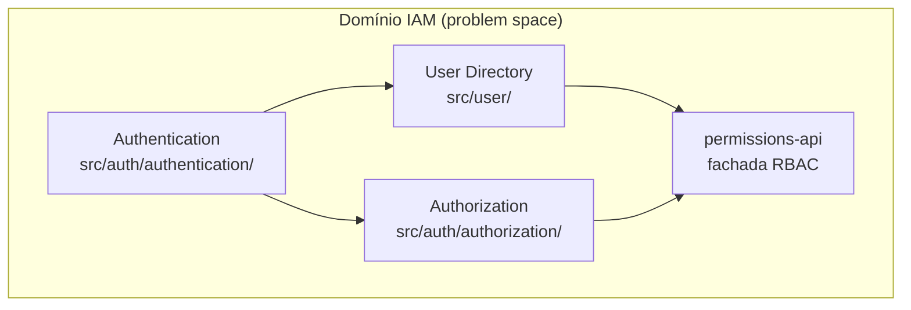

# Análise de domínio — IAM (`user`, `auth`, `permissions-api`)

**Data:** 2026-06-02  
**Método:** [Domain Identification Agent](../.cursor/skills/rules/domain-identification-agent.mdc) + [DOMAIN-IDENTIFICATION-GUIDELINES.md](./DOMAIN-IDENTIFICATION-GUIDELINES.md)  
**Escopo:** `src/user/`, `src/auth/`, `src/permissions-api/` (contexto: `audit-log`, `shared`, fitness function de boundaries)  
**Tipo:** Design estratégico (problem space) — não prescreve refatoração imediata de pastas

**Documentos relacionados:** [ARCHITECTURE-GUIDELINES.md](./ARCHITECTURE-GUIDELINES.md), [FEATURE-FOLDERS-GUIDELINES.md](./FEATURE-FOLDERS-GUIDELINES.md), [coding-patterns.md](./coding-patterns.md), [authorization.md](./authorization.md)

---

## Resumo executivo

| Aspecto | Conclusão |
|--------|-----------|
| **Domínios (problem space)** | **1** — Identity & Access Management (IAM) |
| **Módulos analisados** | **3 bounded contexts na solution space**, não 3 domínios distintos |
| `src/user/` | Subdomínio **User Directory** (Supporting) |
| `src/auth/` | Subdomínios **Authentication** + **Authorization** (Generic) |
| `src/permissions-api/` | **Fachada de integração** (Published Language), não subdomínio de negócio |
| **Coesão geral IAM** | **Alta** — fronteiras e `yarn run check:boundaries` já existem |
| **Prioridade arquitetural** | Consolidar fachada RBAC, endurecer boundaries, preparar extração — **sem** microserviços até gate de produto |

**Objetivo do repositório:** referência de padrões IAM (`auth-patterns-ref`), não um produto com core domain comercial. Neste codebase, o **IAM inteiro** funciona como o “core” do projeto.

---

## 1. Mapa de domínio

### Domínio: Identity & Access Management (IAM)

**Tipo (neste repo):** Core do projeto (referência de padrões)  
**Coesão:** **8/10** ✅  
**Linguagem ubíqua:** user, principal, sign-in, JWT, role, permission, action, subject, audit actor, policy

**Conceitos extraídos do código:**

| Conceito | Tipo | Módulo |
|----------|------|--------|
| `UserService`, `UserController` | Service / Controller | `user` |
| `IUserDirectory`, `UserRepository` | Port / Adapter | `user` |
| `IUserCredentialsReader`, `AuthRepository` | Port / Adapter | `user` (port) + `auth` (adapter) |
| `AuthService`, `AuthController`, `AuthGuard` | Service / Controller / Guard | `auth/authentication` |
| `AbilityFactory`, `POLICY_MAP`, `PermissionsGuard` | Service / Policy / Guard | `auth/authorization` |
| `Action`, `Subject`, `CheckPermissions`, `IPermissionChecker` | API pública RBAC | `permissions-api` (+ implementação em `auth`) |

### Subdomínios

#### 1. User Directory (Supporting)

- **Conceitos:** CRUD de usuário, paginação, hash na criação, auditoria `USER_*`
- **Coesão:** **9/10** ✅
- **Dependências:** → `permissions-api`; → `audit-log/events`; → `shared`
- **Não faz:** sign-in, JWT, matriz de políticas

#### 2. Authentication (Generic)

- **Conceitos:** `signIn`, verificação de senha, emissão JWT, `AuthGuard`, `@Public()`
- **Coesão:** **8/10** ✅
- **Dependências:** → `user/domain/ports` (`IUserCredentialsReader`); → `shared`; → audit events
- **Acoplamento intencional:** leitura de credenciais via port — acoplamento técnico baixo; conceitual aceitável (login precisa de usuário)

#### 3. Authorization / Access Control (Generic)

- **Conceitos:** RBAC, `POLICY_MAP`, `AbilityFactory`, `PermissionsGuard`
- **Coesão:** **8/10** ✅
- **Dependências:** política amarrada a `Subject.USER` (recurso do User Directory) — vínculo de negócio esperado

#### 4. `permissions-api` — camada de integração (não subdomínio)

- **Papel:** Open Host Service / fachada para consumidores (`user`) sem importar `auth/authorization/*`
- **Coesão como “módulo de negócio”:** **5–6/10** ⚠️ — esperado para fachada
- **Contrato:** SSOT em `permissions-api`; `auth/authorization` implementa ([adr-rbac-contract-ssot.md](./adr-rbac-contract-ssot.md))

---

## 2. Matriz de coesão (integração)

Fórmula de referência (guidelines): Linguistic (0–3) + Usage (0–3) + Data (0–2) + Change (0–2) → /10.

| De | Para | Coesão | Tipo | Issue? |
|----|------|--------|------|--------|
| User Directory | Access Control | **6/10** | Interface (`permissions-api`) | ⚠️ OK tecnicamente |
| Authentication | User Directory | **6/10** | Port (`user/domain/ports`) | ⚠️ OK por design (Shared Kernel) |
| `permissions-api` | `auth/authorization` | **8/10** | Implementação importa contrato (pós-SSOT) | ✅ Resolvido |
| User Directory | Authentication | — | Sem import direto (`check:boundaries`) | ✅ |
| IAM (`user`, `auth`) | Audit | **7/10** | Eventos (`publishAudit`) | ✅ |

**Fitness function:** [scripts/check-domain-boundaries.mjs](../scripts/check-domain-boundaries.mjs) — audita `src/user`, `src/auth` e `src/permissions-api` (proíbe `permissions-api → auth|user`).

---

## 3. Issues de baixa coesão

### Issue #1: Fachada RBAC depende da implementação — **RESOLVIDA** (2026-06-02)

| Campo | Valor |
|-------|--------|
| **ADR** | [adr-rbac-contract-ssot.md](./adr-rbac-contract-ssot.md) |
| **Correção aplicada** | `Action`, `Subject`, `CheckPermissions`, `PermissionRequirement` em `src/permissions-api/`; `auth/authorization` importa da fachada; `check:boundaries` cobre `permissions-api`. |

### Issue #2: Dois adapters na mesma tabela `User`

| Campo | Valor |
|-------|--------|
| **Local** | `UserRepository` vs `AuthRepository` |
| **Tipo** | Data cohesion indireta (Shared Kernel) |
| **Problema** | Dois caminhos Prisma para o mesmo agregado — proposital (`omit passwordHash` vs credenciais). |
| **Coesão dados** | **1/10** entre módulos — **aceitável** com ADR de Shared Kernel |
| **Prioridade** | **Baixa** |

### Issue #3: Port de credenciais no módulo `user`

| Campo | Valor |
|-------|--------|
| **Local** | `user/domain/ports/user-credentials-reader.port.ts` |
| **Tipo** | Acoplamento conceitual (Rule 3) |
| **Problema** | Linguisticamente “credentials” é Authentication; o port está em User por readiness de extração. |
| **Coesão** | **6/10** — justificado |
| **Alternativa (futuro)** | Port no lado auth com adapter em user, ou contrato em `shared/contracts` — só se extração exigir |
| **Prioridade** | **Baixa** |

### Issue #4: Assimetria física `user/application/` vs `auth/` flat

| Campo | Valor |
|-------|--------|
| **Tipo** | Boundaries estruturais (não de domínio) |
| **Prioridade** | **Baixa** — cosmético |

---

## 4. O que está bem (não reabrir)

- **Não recriar `src/identity/`** — stack paralelo rico deprecado; ver [§ 8](#8-decisão-sobre-srcidentity).
- **Audit por eventos** — IAM não acopla a `AuditLogService`.
- **Guards globais** em `AppModule` — pipeline Auth → Permissions coerente.
- **Projeções separadas** — `IUserDirectory` sem `passwordHash`; credenciais só no reader.
- **`yarn run check:boundaries`** para `user` e `auth`.

---

## 5. Próximos passos de arquitetura

### Fase A — Consolidar fronteiras — **concluída** (2026-06-02)

1. ~~Inverter dependência da fachada RBAC~~ — feito ([adr-rbac-contract-ssot.md](./adr-rbac-contract-ssot.md)).
2. ~~Estender `check-domain-boundaries.mjs` para `permissions-api`~~ — feito.
3. **Gate local** — `npm run verify` + README; CI remoto opcional no futuro.
4. **Não adicionar tactical DDD pesado** sem invariantes reais (lockout, política de senha, estados de conta).

### Fase B — Readiness para novos bounded contexts (médio prazo)

5. **Primeiro módulo fora IAM (ex.: billing)** — checklist em [coding-patterns.md](./coding-patterns.md#new-module-checklist).
6. **Completar ADRs / docs de extração** referenciados em [ARCHITECTURE-GUIDELINES.md](./ARCHITECTURE-GUIDELINES.md).
7. **Shared Kernel explícito** — User Directory **dono** de migrations/modelo `User`; Authentication só leitura via port até API separada.

### Fase C — Extração (somente com gate de produto)

8. **Não extrair microserviços agora** — fase 3 = readiness only ([extraction-feasibility-gate.md](./extraction-feasibility-gate.md)).
9. **Ordem natural de extração (quando liberado):** Audit → Access Control → User Directory, com `permissions-api` estável como contrato entre serviços.

### Fase D — Evolução funcional

10. **Novos subjects/actions** — estender `Subject` / `POLICY_MAP` / decorators; evitar `if (role)` nos services.
11. **Invariantes de domínio** — então considerar `user/domain/*.entity.ts` e testes sem Nest (skill `tactical-ddd`).

### Decisão prática imediata

> ~~Tornar `permissions-api` o SSOT~~ — **implementado.** Próximo foco: Fase B (template de novo bounded context, ADRs de extração) sem microserviços até gate G5.

---

## 6. Relação com `MODULAR-ARCHITECTURE-GUIDELINES.md`

Para **este** repositório IAM:

| Camada | Mapeamento |
|--------|------------|
| **Problem space** | 1 domínio IAM, 3 subdomínios (+ audit transversal) |
| **Solution space** | Módulos Nest atuais mapeiam 1:1 com subdomínios, exceto `permissions-api` (integração) |
| **Stance** | [clean-arch-lite](../.cursor/skills/clean-arch-lite/SKILL.md) — ports + services + repositories |

Use [MODULAR-ARCHITECTURE-GUIDELINES.md](./MODULAR-ARCHITECTURE-GUIDELINES.md) ao adicionar **novos** domínios (billing, catalog), não para reestruturar IAM sem necessidade.

---

## 7. Summary (formato agent)

**Domains Identified:** 1

- IAM (Core deste repo) — Cohesion: **8/10** ✅

**Subdomains Identified:** 3 (+ 1 fachada)

- User Directory (Supporting) — **9/10** ✅
- Authentication (Generic) — **8/10** ✅
- Authorization (Generic) — **8/10** ✅
- `permissions-api` (integração) — **5–6/10** ⚠️

**Cohesion Issues:** 3 open (+ 1 resolved)

- ~~1 High Priority (fachada RBAC invertida)~~ **Resolvida**
- 2 Medium/Low (Shared Kernel, port placement)
- 1 Low (assimetria de pastas)

**Overall Assessment:**

- ✅ Subdivisão `user` / `auth` / `permissions-api` alinhada a DDD estratégico e extração futura
- ✅ Boundaries enforcement e audit desacoplado
- ✅ `permissions-api` é SSOT do contrato RBAC
- ❌ Não reunificar em `src/identity/` sem gatilhos de produto (ver § 8)

---

## 8. Decisão sobre `src/identity/`

### Pergunta

Devemos reconsiderar recriar `src/identity/` (stack rico com entities, VOs, `infrastructure/`)?

### Resposta: **Não** (manter decisão atual)

A análise estratégica **não** indica falta de um módulo “Identity”. Indica **um domínio IAM** com subdomínios já separados na solution space. Recriar `src/identity/` como implementação paralela traria:

- Dois modelos mentais para quem clona o repo
- Fronteira dupla (oposto ao `check:boundaries`)
- Custo sem ganho de coesão (gap real é a fachada RBAC)

### Quando reconsiderar (gatilhos explícitos)

Reabrir via ADR novo apenas se **pelo menos um** for verdadeiro:

1. **Invariantes de domínio reais** — lockout, política de senha, verificação de e-mail, estados de conta.
2. **Objetivo pedagógico** — repo passa a ser referência de tactical DDD, não só Nest/JWT/RBAC.
3. **Extração iminente como único “Identity Service”** — um deploy; pacote agregador sem duplicar `user` + `auth`.
4. **Dor de navegação** — agrupador cosmético (`IamModule` ou doc) **sem** mover código nem duplicar stack.

### Alternativas preferíveis a recriar `identity/`

| Motivação | Alternativa |
|-----------|-------------|
| Camadas limpas | Ports + adapters (já existem) |
| Auth e User misturados | `user` + `auth` + fitness function (já existem) |
| Um lugar para IAM | Problem space = IAM; solution = módulos separados (correto para extração) |
| DDD “de verdade” | Entidades pontuais em `user/domain/` quando houver regras |
| Contrato RBAC estável | SSOT em `permissions-api` (Fase A) |
| Agrupamento Nest | `IamModule` que importa `UserModule` + `AuthModule` (opcional, sem duplicação) |

### Risco de reconsiderar sem gatilho

Referência confusa, mais arquivos, testes duplicados, boundaries mais frágeis.

**Referência histórica:** [identity-stack-decision.md](./identity-stack-decision.md), [coding-patterns.md](./coding-patterns.md) (nota sobre `src/identity/` deprecado).

---

## 9. Checklist de validação (Domain Identification Agent)

- [x] Guidelines de [DOMAIN-IDENTIFICATION-GUIDELINES.md](./DOMAIN-IDENTIFICATION-GUIDELINES.md) seguidas
- [x] Processo: conceitos → linguagem → domínio → subdomínios → coesão → integração → issues
- [x] Coesão pontuada por grupo
- [x] Regras 1–6 de baixa coesão aplicadas
- [x] Recomendações acionáveis e priorizadas
- [x] Distinção problem space vs solution space
- [x] Posição sobre `src/identity/` documentada

---

## 10. Referências de código

| Artefato | Caminho |
|----------|---------|
| User module | `src/user/application/user.module.ts` |
| Auth module | `src/auth/auth.module.ts` |
| App wiring | `src/app.module.ts` |
| Boundaries script | `scripts/check-domain-boundaries.mjs` |
| Permissions facade | `src/permissions-api/index.ts` |
| Policy map | `src/auth/authorization/policy-map.ts` |
