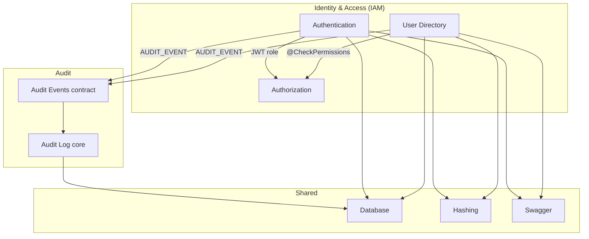

# Domain Identification & Grouping: IAM (`user`, `auth`, `audit-log`, `shared`)

Groups architectural **components** into logical **domains** (business areas) to prepare for domain-aligned namespaces and future domain services. Uses the **domain-identification-grouping** skill.

**Inputs:** [Domain Analysis](./domain-analysis-user-auth.md), [Component Inventory](./component-inventory.md), [Coupling Analysis](./coupling-analysis-user-auth.md), [Common Domain Detection](./common-domain-detection-user-auth.md), [Component Flattening](./component-flattening-analysis-user-auth.md)  
**Scope:** Logical components under `src/user/`, `src/auth/`, `src/audit-log/`, `src/shared/` (production layout; `src/identity/` noted as parallel, out of scope)  
**Date:** 2026-05-20

---

## Executive Summary

```
DOMAINS IDENTIFIED:        3  (IAM, Audit, Shared)
COMPONENTS ASSIGNED:      10 / 10
DOMAIN COHESION:          High (IAM internal subdomains already validated)
NAMESPACE MISALIGNMENTS:  3 root namespaces with orphaned code (see flattening)
HIGH-PRIORITY REFACTOR:   src/auth/ → authentication/ leaf (aligns domain + flattening)
SERVICE EXTRACTION:       Not recommended at current scale (~350 statements)
```

| Domain | Namespace (current) | Components | Statements | % of scope |
|--------|----------------------|------------|------------|------------|
| **Identity & Access (IAM)** | `src/user/`, `src/auth/` | 6 | 287 | 82% |
| **Audit** | `src/audit-log/` | 2 | 27 | 8% |
| **Shared** | `src/shared/` | 3 | 36 | 10% |

**Key finding:** Business domains map cleanly to existing top-level folders except **Authentication**, which shares `src/auth/` root with a sibling subdomain (**Authorization**). Grouping is **semantically correct** today; **physical namespaces** should catch up via the flattening plan (not a merge of domains).

---

## Phase 1: Identified Domains

Domains are **logical business areas** (capabilities), not technical layers (controllers vs services).

### Domain 1: Identity & Access (IAM)

**Suggested namespace root:** `iam` (target) · **Current:** `user` + `auth` (split package)

**Business capability:** Manage user accounts, authenticate sessions (JWT), and authorize operations by role.

**Ubiquitous language:** User, Role, Credentials, Sign-in, Access Token, Permission, Action, Subject, Ability, Policy

**Subdomains (from [domain analysis](./domain-analysis-user-auth.md)):**

| Subdomain | Type | Current path |
|-----------|------|--------------|
| User Directory | Supporting | `src/user/` |
| Authentication | Generic | `src/auth/` (root files) |
| Authorization | Supporting | `src/auth/authorization/` |

**Boundaries:**

- Clear separation from **Audit** (event contract only; no audit imports from IAM)
- Clear separation from **Shared** (infrastructure; IAM consumes, does not own)
- **Internal boundary:** Authentication vs Authorization — linguistic split not yet reflected at `src/auth/` root ([flattening](./component-flattening-analysis-user-auth.md))

**Cohesion:** ✅ High — shared IAM vocabulary; User Directory + Access Control used together at runtime (`AppModule` global guards).

---

### Domain 2: Audit

**Suggested namespace root:** `audit` · **Current:** `src/audit-log/`

**Business capability:** Record security-relevant actions (who did what, when) for compliance and troubleshooting.

**Ubiquitous language:** Audit log, action, actor, target, `AUDIT_EVENT`, `AuditEvent`

**Boundaries:**

- **Inbound-only** integration from IAM ([coupling analysis](./coupling-analysis-user-auth.md)) — publishers do not call `AuditLogService` directly
- Contract surface: `src/audit-log/events/` (keep as published API)

**Cohesion:** ✅ High — persistence + event listener + contract folder form one cross-cutting capability.

---

### Domain 3: Shared

**Suggested namespace root:** `shared` · **Current:** `src/shared/` ✅ aligned

**Business capability:** Cross-cutting technical capabilities reused by multiple domains (not a product business area).

**Components:** Database (Prisma), Hashing (Argon2), Swagger (OpenAPI)

**Boundaries:**

- No imports from `user`, `auth`, or `audit-log`
- Consumed by IAM and Audit only

**Cohesion:** ✅ High — each leaf folder is a single infrastructure concern ([component inventory](./component-inventory.md)).

---

### Out of scope (reference only)

| Path | Note |
|------|------|
| `src/identity/` | Parallel, richer IAM layout (domain layer, ports, events). Not grouped here; if it becomes primary, re-run this analysis and deprecate `user/` + `auth/`. |

---

## Phase 2: Component → Domain Assignment

All components from [component inventory](./component-inventory.md) assigned exactly once.

### Component Domain Assignment Table

| Component | Current namespace | Assigned domain | Subdomain | Target namespace | Action |
|-----------|-------------------|-----------------|-----------|------------------|--------|
| User Directory (core) | `src/user/` (root) | IAM | User Directory | `src/iam/user/application/` *or* `src/user/application/` | Split up (medium) |
| User DTOs | `src/user/dto/` | IAM | User Directory | `src/iam/user/dto/` *or* `src/user/dto/` | No change |
| Authentication | `src/auth/` (root) | IAM | Authentication | `src/iam/auth/authentication/` *or* `src/auth/authentication/` | **Split up (high)** |
| Authorization | `src/auth/authorization/` | IAM | Authorization | `src/iam/auth/authorization/` *or* `src/auth/authorization/` | No change |
| Auth DTOs | `src/auth/dto/` | IAM | Authentication | `src/auth/authentication/` (merge file) | Merge into authentication leaf |
| Audit Log (core) | `src/audit-log/` (root) | Audit | — | `src/audit-log/persistence/` (optional) | Defer |
| Audit Events (contract) | `src/audit-log/events/` | Audit | — | `src/audit-log/events/` | No change |
| Shared: Hashing | `src/shared/hashing/` | Shared | — | `src/shared/hashing/` | No change |
| Shared: Database | `src/shared/database/` | Shared | — | `src/shared/database/` | No change |
| Shared: Swagger | `src/shared/swagger/` | Shared | — | `src/shared/swagger/` | No change |

\* **Two namespace strategies** (pick one per migration phase):

| Strategy | When to use | Example |
|----------|-------------|---------|
| **A — Subdomain folders only** (recommended now) | Reference repo; minimal churn | `src/auth/authentication/`, `src/user/application/` |
| **B — Top-level domain node** | Preparing multiple domain services | `src/iam/user/...`, `src/audit/...` |

Strategy **A** satisfies domain grouping and [flattening](./component-flattening-analysis-user-auth.md) without moving `AppModule` import roots. Strategy **B** is the stepping stone to extracted services.

---

### Domain: IAM — component tree

```
Identity & Access (IAM) — 287 statements (82%)
├── User Directory (148 stmts)
│   ├── User Directory (core)     src/user/*.ts
│   └── User DTOs                 src/user/dto/
└── Access Control (139 stmts)
    ├── Authentication (77)       src/auth/*.ts + dto/
    └── Authorization (62)        src/auth/authorization/
```

---

### Domain: Audit — component tree

```
Audit — 27 statements (8%)
├── Audit Log (core)              src/audit-log/*.ts
└── Audit Events (contract)       src/audit-log/events/
```

---

### Domain: Shared — component tree

```
Shared — 36 statements (10%)
├── Hashing                       src/shared/hashing/
├── Database                      src/shared/database/
└── Swagger                       src/shared/swagger/
```

---

## Phase 3: Validate Domain Groupings

### Cohesion checklist

| Domain | Shared business language? | Used together? | Direct relationships? | Verdict |
|--------|---------------------------|----------------|----------------------|---------|
| IAM | ✅ User, role, token, permission | ✅ Guards + CRUD + sign-in | ✅ JWT `role` → `AbilityFactory` | ✅ Valid |
| Audit | ✅ Audit action vocabulary | ✅ Publishers + consumer | ✅ Event contract | ✅ Valid |
| Shared | ✅ Infra terms only | ✅ DB + hash in IAM | N/A (utilities) | ✅ Valid |

### Boundary checklist

| Check | Status | Notes |
|-------|--------|-------|
| All components assigned | ✅ | 10/10 |
| Single primary domain per component | ✅ | Auth DTOs → Authentication subdomain |
| Clear IAM vs Audit | ✅ | Event-based; audit never imports user/auth |
| Clear IAM vs Shared | ✅ | One-way dependency |
| No forced merges | ✅ | Repos not merged ([common domain](./common-domain-detection-user-auth.md)) |
| Stakeholder validation | ⏳ | Reference project — validate if productizing |

### Edge cases resolved

| Case | Resolution |
|------|------------|
| `AuthGuard` + `PermissionsGuard` global in `AppModule` | **Composition root** — belongs to IAM domain, wired at app boundary; not a fourth domain |
| `UserRole` duplicated across DTOs / policy / JWT | Stays in **IAM**; consolidate type in Shared or IAM contract ([common domain](./common-domain-detection-user-auth.md)) |
| `HashingService` in Shared | **Shared** domain (infrastructure), not IAM — correct |
| `audit-log/events` used by IAM | **Audit** domain publishes contract; IAM is **customer** of that API |

---

## Phase 4: Namespace Refactoring Plan

Aligns physical paths with domain boundaries and [component flattening](./component-flattening-analysis-user-auth.md).

### Priority: High — IAM / Authentication leaf

**Goal:** One subdomain = one leaf folder under `src/auth/`.

| Component | Current | Target (Strategy A) | Target (Strategy B) |
|-----------|---------|---------------------|---------------------|
| Authentication stack | `src/auth/*.ts` | `src/auth/authentication/` | `src/iam/auth/authentication/` |
| Sign-in DTO | `src/auth/dto/sign-in.dto.ts` | `src/auth/authentication/sign-in.dto.ts` | same under `iam` |
| Authorization | `src/auth/authorization/` | unchanged | `src/iam/auth/authorization/` |
| Composer module | `src/auth/auth.module.ts` | thin `src/auth/auth.module.ts` | `src/iam/auth/auth.module.ts` |

**Steps:**

1. Create `authentication/`; move authn files from `src/auth/` root.
2. Merge `dto/sign-in.dto.ts` into `authentication/`.
3. Update `auth.module.ts`, `app.module.ts`, and spec import paths.
4. Leave `user.controller` import as `../auth/authorization` (Customer/Supplier unchanged).

**Expected impact:** Linguistic boundary visible in tree; no coupling dimension change ([coupling analysis](./coupling-analysis-user-auth.md)).

---

### Priority: Medium — IAM / User Directory leaf

| Component | Current | Target (Strategy A) | Target (Strategy B) |
|-----------|---------|---------------------|---------------------|
| User core stack | `src/user/*.ts` | `src/user/application/` | `src/iam/user/application/` |
| User DTOs | `src/user/dto/` | unchanged | `src/iam/user/dto/` |

**Steps:** Move four root files; update `app.module` → `./user/application/user.module`.

**When:** Same PR as auth split, or immediately after, for consistent IAM layout.

---

### Priority: Low — Audit optional `persistence/` leaf

| Component | Current | Target |
|-----------|---------|--------|
| Audit Log (core) | `src/audit-log/*.ts` | `src/audit-log/persistence/` |

**Defer** until audit contract work ([common domain](./common-domain-detection-user-auth.md)); **do not** flatten `events/` upward.

---

### Priority: Defer — Top-level `src/iam/` rename (Strategy B)

| Current | Target | When |
|---------|--------|------|
| `src/user/` + `src/auth/` | `src/iam/user/`, `src/iam/auth/` | Before extracting IAM domain service |
| `src/audit-log/` | `src/audit/` | Before extracting Audit domain service |

**Not recommended now** — ~350 statements; high churn for teaching repo.

---

### Namespace alignment summary

| Domain | Aligned today? | Next action |
|--------|----------------|-------------|
| Shared | ✅ | None |
| Audit | ⚠️ Root orphans | Optional `persistence/`; keep `events/` |
| IAM — Authorization | ✅ Leaf | None |
| IAM — User Directory | ⚠️ Root orphans | `user/application/` |
| IAM — Authentication | ❌ Mixed in `auth/` root | `auth/authentication/` **(high)** |

---

## Phase 5: Domain Map

### Domain structure (logical)

```
┌─────────────────────────────────────────────────────────────┐
│ Identity & Access (IAM)                                     │
├─────────────────────────────────────────────────────────────┤
│ User Directory                                              │
│   • User Directory (core)  • User DTOs                      │
│ Access Control                                              │
│   • Authentication  • Auth DTOs  • Authorization              │
└─────────────────────────────────────────────────────────────┘
         │ uses (CONTRACT)              │ uses (infra)
         ▼                              ▼
┌──────────────────────┐    ┌──────────────────────────────┐
│ Audit                │    │ Shared                        │
├──────────────────────┤    ├──────────────────────────────┤
│ • Audit Log (core)   │    │ • Hashing  • Database         │
│ • Audit Events       │    │ • Swagger                     │
└──────────────────────┘    └──────────────────────────────┘
```

### Domain relationships



**Integration patterns (by domain pair):**

| From | To | Pattern | Healthy? |
|------|-----|---------|----------|
| IAM (User Directory) | IAM (Authorization) | Customer/Supplier | ✅ |
| IAM (Authentication) | IAM (Authorization) | Shared Kernel (`JwtPayload`) | ✅ |
| IAM | Audit | Published language (events) | ✅ |
| IAM | Shared | Generic utility | ✅ |
| Audit | IAM | None (inbound only) | ✅ |

---

## Domain Inventory

| Domain | Components | Files (prod.) | Statements | % scope | Cohesion |
|--------|------------|---------------|------------|---------|----------|
| IAM | 6 | 22 | 287 | 82% | High |
| Audit | 2 | 4 | 27 | 8% | High |
| Shared | 3 | 6 | 36 | 10% | High |
| **Total** | **10** | **31** | **350** | **100%** | — |

**IAM internal split (for future services):**

| Future domain service | Subdomains included | Rough size |
|----------------------|---------------------|------------|
| `iam-service` (Option A monolith) | User Directory + Authentication + Authorization | 287 stmts |
| `user-directory-service` (Option B) | User Directory only | 148 stmts |
| `access-control-service` (Option B) | Authentication + Authorization | 139 stmts |
| `audit-service` | Audit (full) | 27 stmts |
| N/A (stay in app) | Shared | 36 stmts |

Matches [domain analysis Option B](./domain-analysis-user-auth.md#option-b--linguistic-split-future-evolution).

---

## Cross-Domain Access Rules (governance)

For fitness functions when enforcing domain boundaries:

| Rule | Allowed | Violation example |
|------|---------|-------------------|
| IAM → Shared | ✅ Direct import | — |
| IAM → Audit | ✅ Only `audit-log/events` | Importing `audit-log.service` |
| Audit → IAM | ❌ Direct | `audit-log` importing `user.service` |
| Audit → Shared | ✅ Database | — |
| IAM subdomain → IAM subdomain | ✅ Published APIs (`authorization`, events) | Importing `auth.repository` from `user.service` |
| Shared → any app domain | ❌ | Shared importing `user` |

---

## Suggested Fitness Functions

```typescript
// Domain assignment rules (Strategy A — current top-level folders)
const DOMAIN_RULES: Record<string, 'iam' | 'audit' | 'shared'> = {
  user: 'iam',
  auth: 'iam',
  'audit-log': 'audit',
  shared: 'shared',
};

function identifyDomain(filePath: string): string | null {
  const match = filePath.match(/^src\/([^/]+)/);
  if (!match) return null;
  return DOMAIN_RULES[match[1]] ?? null;
}

// Cross-domain import violations (allow shared + audit events contract)
function isAllowedImport(fromFile: string, importPath: string): boolean {
  const from = identifyDomain(fromFile);
  const to = importPath.includes('audit-log/events')
    ? 'audit'
    : identifyDomain(importPath.replace(/\.\./g, 'src/')); // simplified
  if (!from || !to) return true;
  if (to === 'shared') return true;
  if (from === 'audit') return to === 'shared';
  if (from === 'iam' && to === 'audit' && importPath.includes('events')) return true;
  return from === to;
}
```

---

## Recommendations & Next Steps

### Do now (namespace / grouping)

1. **Execute high-priority refactor:** `src/auth/authentication/` per [flattening plan](./component-flattening-analysis-user-auth.md).
2. **Document domain membership** in `README` or `docs/coding-patterns.md`: three domains, IAM subdomains, published surfaces (`authorization`, `audit-log/events`).
3. **Consolidate `UserRole`** inside IAM (shared contract file) — [common domain](./common-domain-detection-user-auth.md).

### Do when growing

1. **`src/user/application/`** — medium priority flattening.
2. **Strategy B** (`src/iam/`, `src/audit/`) — only before service extraction.
3. **Ports** (`IUserDirectory`, `IUserCredentialsReader`) — before splitting User Directory from Access Control services.

### Do not

- Merge `user` + `auth` folders into one directory (blurs subdomains).
- Move Authorization under `user` (breaks Customer/Supplier).
- Collapse `audit-log/events` into root (weakens contract).
- Extract microservices at current size ([component inventory](./component-inventory.md)).

### Pipeline position (Pattern 6 prep)

| Step | Artifact | Status |
|------|----------|--------|
| Domain analysis (strategic) | [domain-analysis-user-auth.md](./domain-analysis-user-auth.md) | ✅ |
| Component inventory | [component-inventory.md](./component-inventory.md) | ✅ |
| Coupling analysis | [coupling-analysis-user-auth.md](./coupling-analysis-user-auth.md) | ✅ |
| Common domain detection | [common-domain-detection-user-auth.md](./common-domain-detection-user-auth.md) | ✅ |
| Component flattening | [component-flattening-analysis-user-auth.md](./component-flattening-analysis-user-auth.md) | ✅ |
| **Domain identification & grouping** | **this document** | ✅ |
| Create domain services (Pattern 6) | — | ⏳ Future |

---

## Analysis Checklist

**Domain identification**

- [x] Analyzed component responsibilities ([inventory](./component-inventory.md))
- [x] Identified business capabilities (IAM, Audit, Shared)
- [x] Identified distinct domains (3)
- [ ] Stakeholder validation (N/A for reference repo)

**Component grouping**

- [x] Assigned each component to a domain (10/10)
- [x] Analyzed relationships ([coupling](./coupling-analysis-user-auth.md), [domain analysis](./domain-analysis-user-auth.md))
- [x] Handled edge cases (global guards, shared hashing, audit contract)
- [x] IAM subdomains mapped under parent domain

**Domain validation**

- [x] Cohesion within domains
- [x] Clear boundaries (IAM / Audit / Shared)
- [x] All components assigned
- [x] No inappropriate cross-domain merges

**Namespace refactoring**

- [x] Compared current vs target (Strategies A and B)
- [x] Prioritized refactoring (high / medium / low / defer)
- [x] Linked to flattening execution plan

**Domain mapping**

- [x] Domain diagram (ASCII + mermaid)
- [x] Domain inventory table
- [x] Documented domain relationships

---

## Related Documentation

- [Domain Analysis: User & Auth](./domain-analysis-user-auth.md)
- [Component Inventory](./component-inventory.md)
- [Coupling Analysis: User & Auth](./coupling-analysis-user-auth.md)
- [Common Domain Detection](./common-domain-detection-user-auth.md)
- [Component Flattening Analysis](./component-flattening-analysis-user-auth.md)
- [Authorization](./authorization.md)
- [Audit Log](./audit-log.md)
